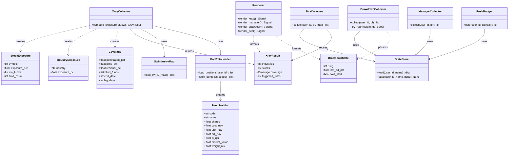
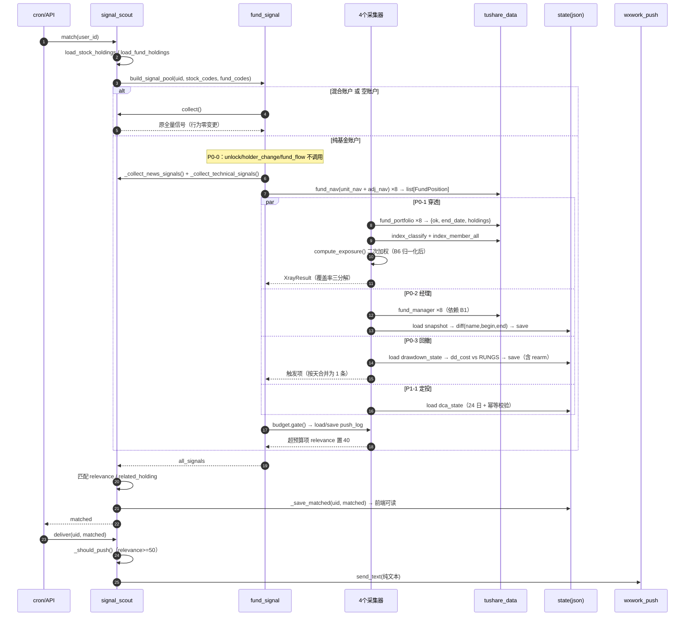
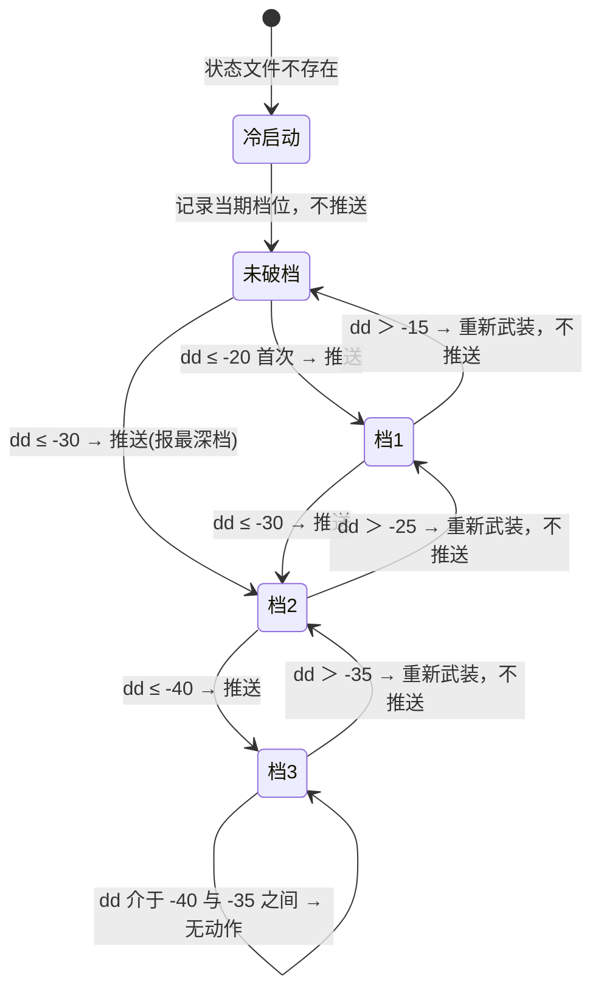
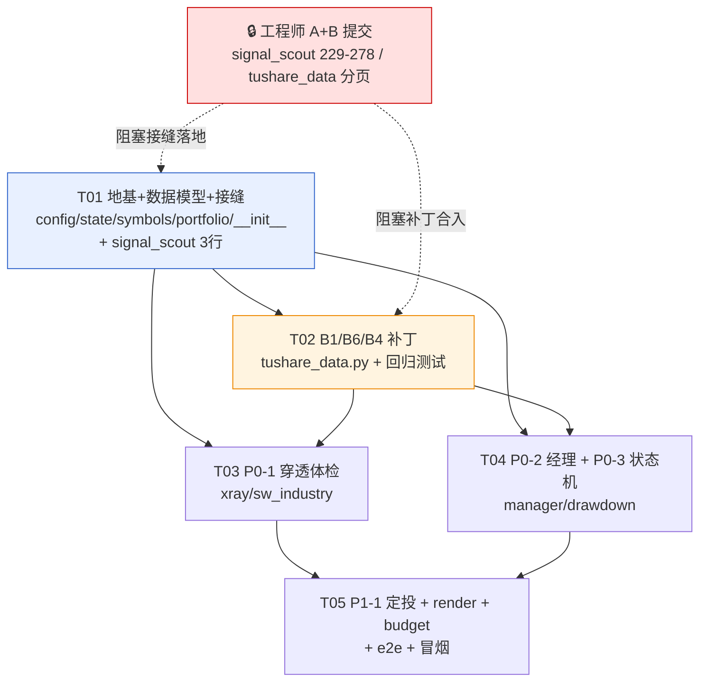

# 系统设计：信号侦察 — 纯基金账户（C 方案）

| 项 | 内容 |
|---|---|
| 设计人 | 高见远（架构师） |
| 输入 | `docs/prd/signal-scout-fund-account.md`（许清楚） |
| 范围 | P0-0 / P0-1 / P0-2 / P0-3 / P1-1 + 前置 Bug B1/B6/B4 |
| 栈 | FastAPI + 原生 JS。**零新增框架、零新增三方包** |
| 状态 | **只读设计**，不修改任何现有代码 |

**已拍板、不再讨论**：① 回撤**触发**基准 = 成本净值（文案同时给「相对成本」+「相对 60 日高点」两口径）；
② 冷启动静默（缺基线只写状态不推送）；③ 范围 = P0-0~P0-3 + P1-1；
④ 2026-10 预告季复测不在本次。

---

## 1. 实现方案

**零新框架。** 现有 `collect()→match()→deliver()` 是同步拉取式（API/cron 触发即跑），状态机靠**落盘 JSON**
维持跨调用状态，与进程重启无关。穿透计算量极小（8 只基金 × 前十大 ≈ 60 行），纯 dict 循环即可，
引入 pandas 只会增加部署风险。并发沿用 `ThreadPoolExecutor`。

关键难点与对策：

| # | 难点 | 对策 |
|---|---|---|
| D1 | 不能大改 `signal_scout.py` / `tushare_data.py`（工程师正在改 A+B） | 新逻辑全放新包 `services/fund_signal/`；`signal_scout.py` 只落 **1 处接缝**（`collect()` 调用从 L505 迁到 L537：删 3 行 + 插 4 行），`tushare_data.py` 只落 **3 处局部补丁**，均按**代码锚点**定位而非行号 |
| D2 | P0-0 要「跳过三个采集器」但 `collect()` 是公共无用户态 | 接缝函数接管调度：纯基金账户时**绕过 `collect()`**，只调 news + technical 两个子采集器，unlock/holder_change/fund_flow **一次都不跑**（真省 10 万行网络预算） |
| D3 | 穿透暴露二次加权（PRD §6.2 的 6 倍偏差坑） | 单一公式、单一实现，见 §3.4 `compute_exposure()` |
| D4 | 港股 `00981.HK`/`0981.HK` 重复计入（B6） | 归一化函数**只有一份实现**（`fund_signal/symbols.py`），`tushare_data.py` 打补丁时 import 它 |
| D5 | 回撤必须状态机（朴素阈值 26 次/月 vs 状态机 1.18 次/月） | 档位状态落盘，含「重新武装」（回到档位上方 5pct 降一档）+ 冷启动静默 |
| D6 | 8 只基金高度相关，同天一起触发 | 按天合并成 1 条 + 全局预算守门（≤4 条/月） |
| D7 | QDII 24.43% 永久无穿透 | 覆盖率**运行时算**，禁止硬编码；不足时文案强制点名盲区清单 |

分层：`signal_scout.match()` → `fund_signal.build_signal_pool()`（调度/判账户类型/预算守门）
→ `portfolio` / `xray`(+`sw_industry`) / `manager` / `drawdown` / `dca` → `render` 出中文文案。

---

## 2. 文件清单

新建包 `backend/services/fund_signal/`：

| 文件 | 职责 | 行数 |
|---|---|---|
| `__init__.py` | 对外唯一入口：`build_signal_pool()` 调度 | 150 |
| `config.py` | 全部阈值常量（档位/阈值/定投日/QDII 判定词），**禁止魔数散落** | 80 |
| `state.py` | 落盘状态读写（原子写 tmp+os.replace） | 110 |
| `symbols.py` | 标的代码归一化（港股去前导零 / A 股补后缀），**B6 唯一实现** | 90 |
| `portfolio.py` | 加载持仓 → `FundPosition`（份额/成本/市值/权重/是否 QDII） | 130 |
| `sw_industry.py` | 申万二级反查表（`index_member_all` 分页 2 次拿全量 5902 行 + `stock_basic` 降级），7 天落盘缓存 | 130 |
| `xray.py` | P0-1 穿透暴露 + 行业/个股聚合 + 覆盖率三分解 | 220 |
| `manager.py` | P0-2 经理快照 diff（新任/离任配对 + 30 天冷却） | 160 |
| `drawdown.py` | P0-3 回撤档位状态机（触发/重新武装/冷启动/按天合并） | 200 |
| `dca.py` | P1-1 每月 24 日快照（幂等，同月只推 1 次） | 120 |
| `render.py` | 4 类信号中文纯文本文案 | 260 |
| `budget.py` | 推送预算守门（≤4 条/月、≤2 条/日）+ 计数落盘 | 90 |

测试与脚本：`tests/test_fund_signal_symbols.py`(90)、`tests/test_fund_signal_bugfix.py`(130)、
`tests/test_fund_drawdown_state.py`(180)、`tests/test_fund_xray.py`(150)、
`tests/test_fund_signal_e2e.py`(120)、`scripts/fund_signal_smoke.py`(110)、
`tests/fixtures/fund_holdings_leijiang.json`。

**修改的现有文件（仅 2 个）**：

| 文件 | 改动 | 量 |
|---|---|---|
| `backend/services/signal_scout.py` | 唯一接缝：`match()` 内 `collect()` 调用从 L505 迁到 L537（持仓加载后），替换为 `build_signal_pool()` | **4 行** |
| `backend/services/tushare_data.py` | B1(≈12) + B6(≈25) + `all_managers`(1) + B4(1) | **≈39 行** |

**绝对不动**：`fund_screen.py`，以及这两个文件的其余任何部分。

---

## 3. 数据结构与接口

### 3.1 信号字典（与现有格式 100% 兼容）

```python
Signal = dict  # 字段必须逐一对齐，否则 deliver()/前端不认：
# {"type": str, "title": str, "content": str, "codes": list[str],
#  "source": str, "time": "YYYY-MM-DD HH:MM:SS",
#  "level": "danger"|"warning"|"info", "tags": list[str],
#  "relevance": int,       # ← 推送开关，见下
#  "related_holding": str} # 中文基金简称
# type ∈ {"fund_xray_concentration","fund_manager_change",
#          "fund_drawdown_rung","dca_preflight"}
```

> **推送开关约定（写死，不要另发明机制）**：`relevance=100` → 企微推送（`_should_push()` 校验 ≥50 通过）；
> `relevance=40` → 写进 `_save_matched()` 供前端 `/api/signal-scout/latest` 读，但不推送。
> **不改 `_should_push()`、不改 `deliver()`。**

### 3.2 唯一接缝（写死，交给工程师落地）

**位置**：`signal_scout.py` → `def match(user_id: str)` 内。**锚点有两处，必须成对改动，缺一不可**：

- **锚点 A（L505，删除）**：`match()` 开头的 `all_signals = collect()` 及紧随其后的早退判断。
  原因：此时 `user_stock_codes` / `user_fund_codes` 尚未加载（它们在 L516-533 才定义），
  在 L505 处直接把 `collect()` 换成 `build_signal_pool(..., user_stock_codes, user_fund_codes)`
  会 **NameError**。
- **锚点 B（L537，插入）**：`user_all_codes = {**user_stock_codes, **user_fund_codes}` 之后、
  `matched = []` 之前，插入 `build_signal_pool()` 调用。

锚点代码（行号会漂移，**按此代码定位**）：

```python
# ---- 锚点 A（L505，删除这 3 行）----
    all_signals = collect()
    if not all_signals:
        return []

# ---- 锚点 B（L537，插入）----
    user_all_codes = {**user_stock_codes, **user_fund_codes}
```

**替换为**（锚点 B 处插入，4 行 + 注释）：

```python
    user_all_codes = {**user_stock_codes, **user_fund_codes}

    # ---- 基金账户专用通道（C 方案唯一接缝）----
    # 纯基金账户：跳过 unlock/holder_change/fund_flow，追加 P0-1/P0-2/P0-3/P1-1 基金信号；
    # 持股/混合账户：原样 collect()，行为零变更。契约见本文档 §3.2。
    from services.fund_signal import build_signal_pool
    all_signals = build_signal_pool(user_id, user_stock_codes, user_fund_codes)
    if not all_signals:
        return []
```

**净效果**：`collect()` 的调用从 L505 **迁到 L537** 并包进 `build_signal_pool()`；持股/混合账户
行为与改造前完全一致，纯基金账户的 P0-0「跳过三个个股事件采集器」才能真正生效（若 `collect()`
仍在 L505 无条件跑，P0-0 等于没做）。

**接缝函数**（`fund_signal/__init__.py`）：

**函数实现**（这是工程师照着写的部分，分支必须显式出现在代码里，不能只写在注释里）：

```python
def build_signal_pool(user_id: str, stock_codes: dict[str, str],
                      fund_codes: dict[str, str]) -> list[dict]:
    """signal_scout.match() 的唯一接缝。

    ⚠️⚠️ 绕过 collect() 是【条件式】的，不是无条件的：
      - stock_codes 非空（用户持股）→ 原样 collect()，五个采集器一个都不少
      - stock_codes 为空 且 fund_codes 非空（纯基金账户）→ 才跳过三个个股事件采集器

    ⚠️ 分支必须【每次调用时动态求值】，禁止在模块加载时算成常量或用
    模块级开关缓存：用户今天 0 只股票、明天买入股票，行为必须跟着变。
    系统里不止 LeiJiang 一个用户（BuLuoGeLi 组合 7 持仓未知），无条件
    绕过会让持股用户在完全不知情的情况下静默失去个股事件信号 —— 这与
    本次事故的病因（信号在用户不知情时出现）是同一类问题的反面。
    """
    from services import signal_scout
    try:
        is_pure_fund = (not stock_codes) and bool(fund_codes)
        if not is_pure_fund:
            # 混合账户 / 空账户 / 无持仓：行为与改造前完全一致
            return signal_scout.collect()

        # 纯基金账户：P0-0 —— 只跑 news + technical。
        # unlock / holder_change / fund_flow 一次都不调用，真省下
        # share_float 那 10 万行网络预算，而不是"跑完再过滤"。
        pool = _collect_public()
        if pool is None:            # 子采集器缺失/被重命名 → 整体降级
            return signal_scout.collect()

        pool.extend(_collect_fund_signals(user_id) or [])

        # 兜底过滤：即便走纯基金路径，也剔除个股事件类信号。
        # 这是 PRD P0-0 验收标准（matched 中不得出现这三类）的最后一道防线。
        blocked = signal_scout._HOLDING_REQUIRED_TYPES
        return [s for s in pool if s.get("type") not in blocked]
    except Exception as e:
        # 信号侦察是旁路，任何异常都不得阻断 match()/Pipeline
        print(f"[FUND_SIGNAL] build_signal_pool failed: {e}，降级回 collect()")
        return signal_scout.collect()


def _collect_public() -> "list | None":
    """纯基金账户的公共信号：只跑 news + technical。
    返回 None = 子采集器缺失，调用方需整体降级回 collect()。"""
    from services import signal_scout
    pool: list[dict] = []
    for name in ("_collect_news_signals", "_collect_technical_signals"):
        fn = getattr(signal_scout, name, None)
        if fn is None:
            print(f"[FUND_SIGNAL] {name} 不存在（可能已被重命名），降级回 collect()")
            return None
        try:
            pool.extend(fn() or [])
        except Exception as e:
            print(f"[FUND_SIGNAL] {name} failed: {e}")
    return pool


def _collect_fund_signals(user_id: str) -> list[dict]:
    """P0-1/P0-2/P0-3/P1-1 四类基金信号。内部各自 try/except，
    单个采集器失败不影响其他；全部走 render + budget 后返回。"""
```

**为什么一处接缝就够**：P0-0 原本看起来需要在 `collect()` 再加一处（因为 `collect()` 是公共的、
无用户态），解法是让接缝函数在**纯基金分支**里绕过 `collect()` 直接调两个子采集器。
`stock_codes` 非空时原样调 `collect()`，所以持股用户零影响。

> ⚠️ **落地时机**：这 4 行必须在工程师把 A+B（B3 方向判断、share_float 去重、6000 行分页）
> **提交之后**再落。他改的是 `signal_scout.py` 229–278 与 `tushare_data.py`，与 `match()` 不重叠，
> git 自动合并；但未提交的中间态会冲突。

### 3.3 类图



### 3.4 关键函数签名

```python
# ---- portfolio.py ----
def load_positions(user_id: str) -> list[FundPosition]:
    """从 fund_monitor.load_fund_holdings() 读持仓，补最新净值与权重。
    同时写入 unit_nav（回撤触发口径）与 adj_nav（仅用于定位 60 日高点日期）。
    weight_mv = market_value / Σ market_value * 100   # 市值占比（信号口径）
    单位：shares=份额, *_nav=元/份, market_value=元。除不尽按最大余数法补到 100.00%。"""

def fetch_portfolios(codes: list[str], max_workers: int = 8) -> dict[str, dict]:
    """并行拉 fund_portfolio → {code: {"ok":bool, "end_date":str, "ann_date":str,
    "holdings":list}}。ok=False 即无穿透数据（QDII 盲区），不是故障 ——
    调用方必须据此归入 blind_pct，不得静默丢弃。"""

# ---- xray.py —— 穿透暴露的唯一计算入口 ----
def compute_exposure(positions: list[FundPosition], portfolios: dict[str, dict],
                     sw_map: dict[str, str]) -> XrayResult:
    """⚠️ 二次加权公式（PRD §6.2 的 6 倍偏差坑就在这里）：
        exposure[stock] = Σ_fund ( weight_mv[fund] × stk_mkv_ratio[fund][stock] / 100 )
      - stk_mkv_ratio 单位 = 【% 占该基金净值】，不是占用户总净值
      - 结果 exposure_pct 单位 = 【% 占用户总净值】
      - 分母恒为用户总净值（100%），不是"已覆盖部分"

    覆盖率三分解（三者相加恒 = 100%，实测值用于回归断言）：
        penetrated_pct = Σ_stocks exposure_pct                     # 61.8%
        blind_pct      = Σ weight_mv of funds where ok=False       # 24.4%（QDII）
        residual_pct   = Σ weight_mv of ok funds - penetrated_pct  # 13.8%（前十大之外+现金债券）
    验证：016501 权重 15.56% × 北方华创 9.89% = 1.54%（单基金）；
          北方华创被 4 只基金重仓 → 合计 4.53%（= 占用户总净值）

    触发规则（命中任一即 should_push=True）：
        R1 单一申万二级行业 exposure_pct > 25.0
        R2 单一个股 exposure_pct > 3.0
        R3 单一个股 len(via_funds) >= 3
        R4 冷启动首次启用（无条件 1 次基线体检）"""

# ---- sw_industry.py —— 申万二级反查表（实测方案，见 §8.1）----
def load_sw_l2_map() -> dict[str, dict]:
    """返回 {股票代码: {"l1": str, "l2": str, "l3": str}}。

    主路径（实测 2 次调用 / 0.5s）：
        rows = []
        for off in (0, 3000):
            page = _call_tushare("index_member_all", {"offset": off},
                                 "l1_code,l1_name,l2_code,l2_name,l3_code,l3_name,ts_code,name")
            rows.extend(page)
            if len(page) < 3000:      # 未满页即到末尾
                break
        # ⚠️ 单页硬上限 3000 行，offset 有效、limit 无效（设 6000 仍返 3000）
        # ⚠️ 全量约 5902 行，两页即可取完

    降级路径（实测 1 次调用 / 0.3s）：
        stock_basic(list_status=L) → 5555 行，用 industry 字段（110 个分类）。
        抽检与申万二级结果一致，但口径不同，必须置 industry_source 让文案改标。

    落盘缓存：DATA_DIR/_cache/sw_l2_member.json，TTL 7 天（行业分类变动极慢）。
    返回空 dict 时 xray 必须降级为"不区分行业"，只报个股暴露 —— 不得整体失败。"""

# ---- drawdown.py —— P0-3 状态机 ----
def collect(user_id: str, positions: list[FundPosition]) -> list[Signal]:
    """基准（拍板 #1，PRD v2 §5.3.1 / §8 B8 —— 与 v1 相反，勿用 adj_nav 除成本）：
        dd_cost = unit_nav / cost_nav - 1                   ← **触发只认这个**
      ⚠️ cost_nav 是用户实际买入价，与 unit_nav 同尺度；adj_nav 含历史分红再投资，
      与成本不同尺度。002163 用 adj_nav 会得出 +161.37%，正确值 +11.13%（误差 +150.2pct）。

        dd_roll（仅文案辅助展示，不参与触发）：
          high_date = argmax(近 61 个净值日 adj_nav)   ← 用 adj_nav 定位高点【日期】
          dd_roll = unit_nav / unit_nav@high_date - 1  ← 再取该日 unit_nav 计价
      ⚠️ 禁止 adj_nav / cost_nav，也禁止拿 adj_nav 当价格算组合市值
      （002163 的 adj/unit=2.352，组合层面会得出 -42.41% 而正确是 -29.64%）。
      unit_nav 缺失 → 该基金本次不计入回撤触发，打印 [FUND_SIGNAL] 告警；
      adj_nav 缺失 → 仅「60 日高点」参考口径无法给出，不影响触发。

    状态机（RUNGS = [-20.0, -30.0, -40.0]，config.DRAWDOWN_RUNGS）：
        deepest = 最大 i 使 dd_cost*100 <= RUNGS[i]，否则 -1
        deepest > state.rung          → 触发，rung = deepest，推 1 条（按天合并）
        dd_cost*100 > RUNGS[rung]+5.0 → 重新武装，rung -= 1，**不推送**
        其余                          → 无动作（档位内震荡不重推）
    冷启动（拍板 #2）：状态文件不存在 → 写 rung = deepest，cold_start=True，不推送。
    合并：同一天所有触发项合成 1 条 Signal，正文按 dd_cost 升序取 Top3，其余写"其余 N 只见前端"。"""

# ---- manager.py —— P0-2 ----
def collect(user_id: str, positions: list[FundPosition]) -> list[Signal]:
    """diff 键 = (name, begin_date, end_date)。
    冷却：只推 ann_date 在最近 30 天内的记录（防历史回填误报）。
    配对：离任 end_date 与某新任 begin_date 相差 ≤7 天 → 合成"离任→接任"。
    冷启动：快照不存在 → 只写不推。
    ⚠️ B1 未修复前本函数不可用（8 只基金"在任经理"恒为 0）。"""

# ---- dca.py —— P1-1 ----
def collect(user_id: str, positions: list[FundPosition],
            xray: "XrayResult | None") -> list[Signal]:
    """触发日 = 每月 24 日；非交易日（signal_scout.is_trading_day）则向前顺延。
    幂等：state.last_push_month = "YYYY-MM"，同月已推过直接返回 []。"""

# ---- budget.py ----
def gate(user_id: str, signals: list[Signal]) -> list[Signal]:
    """超预算的信号 relevance 从 100 改成 40（落前端不推送）。
    限额：同日 ≤2 条；同月 ≤4 条。
    超预算时按优先级倒序砍：dca_preflight > fund_manager_change
    > fund_drawdown_rung > fund_xray_concentration（见 §8 Q4）。
    计数：state.push_log = {"2026-09": ["2026-09-04T08:12", ...]}"""

# ---- render.py：4 个函数，全部返回 ≤8 行正文的纯中文文本，模板见 §4.3 ----
def render_xray(result: XrayResult, positions: list[FundPosition]) -> Signal: ...
def render_manager(changes: list[dict], positions: list[FundPosition]) -> Signal: ...
def render_drawdown(items: list[dict], positions: list[FundPosition]) -> Signal: ...
def render_dca(snap: dict, positions: list[FundPosition]) -> Signal: ...
```

### 3.5 符号归一化（B6 唯一实现，`symbols.py`）

```python
import re
_HK_RE = re.compile(r"^(\d{1,5})\.HK$", re.IGNORECASE)

def normalize_symbol(raw: str) -> str:
    """fund_portfolio.symbol → 统一标的键。顺序敏感。
      1. 港股（以 .HK 结尾）：数字部分去前导零后补到 5 位
         '00981.HK' / '0981.HK' / '981.HK' → '00981.HK'
         数字部分 >5 位（异常）→ 原样返回并告警
      2. A 股（6 位纯数字）补后缀：6/9→.SH；0/2/3→.SZ；4/8→.BJ
      3. 已带 .SH/.SZ/.BJ → 原样返回
         ⚠️ 绝不对 A 股去前导零 —— '000001.SZ' ≠ '1.SZ'，前导零是代码的一部分
      4. 其余（美股 ticker 等）→ 原样返回，不做任何补零或截断"""
```

`tushare_data.py` 的 B6 补丁必须 `from services.fund_signal.symbols import normalize_symbol`，
**禁止另写一份正则**。

---

## 4. 程序调用流程

### 4.1 时序图：collect → match → deliver



### 4.2 回撤状态机跃迁（P0-3）



### 4.3 文案模板（4 条，纯文本，≤8 行正文）

通用硬要求：**第一行让用户认出自己的基金** · **标注数据时点与滞后天数** · **覆盖率不足时点名未覆盖的基金**
· **不输出 `301563.SZ` 这类原始代码**（用「中文名(6位代码)」）。括号内数字为实现时替换的占位示例。

**P0-1 `fund_xray_concentration`**

```
📊 持仓穿透体检｜半导体占你 33.5% 净值，4 只基金在买同一只票

持仓截止 2026-06-30（公告 2026-07-21，滞后 21 天）
穿透覆盖：你总净值的 61.8%（8 只基金中的 6 只前十大重仓）
未覆盖 38.2%：浦银安盛全球智能科技(006555)、华夏全球科技先锋(005698)
  合计 24.4% 季报无持仓数据，永久无法穿透；其余 13.8% 为各基金
  前十大之外的持股、现金与债券

行业集中（申万二级，占你总净值）：
  半导体 33.5% ｜ 通信设备 13.3% ｜ 元件 4.4% ｜ 电子化学品 3.3%

重复押注 Top3（穿透暴露 = 多只基金重仓合计，占你总净值）：
  北方华创(002371) 4.53% ← 4 只基金同时重仓
  芯源微(688037) 3.98% ← 3 只基金同时重仓
  新易盛(300502) 3.95% ← 4 只基金同时重仓

结论：你持有 8 只基金，但穿透后 6 只境内基金重仓高度重合，
实际分散度远低于"8 只"给人的直觉。
```

**P0-2 `fund_manager_change`**

```
👔 基金经理变更｜财通科技创新混合C(008984) 换人了

你的持仓：财通科技创新混合C(008984)，占你总净值 12.5%
离任：张胤（任职 2021-09-27 至 2026-06-11，共 4.7 年）
接任：袁泽强（自 2026-06-11 起）
公告日：2026-06-12（来源 Tushare fund_manager，滞后 1 天）

主动管理基金的核心变量是基金经理本人。建议复核新任经理的
历史业绩与投资风格，确认是否仍匹配你的科技成长偏好。
```

**P0-3 `fund_drawdown_rung`（成本净值基准，触发只用 `unit_nav`）**

单只基金触发（预期上线首推形态：005698 距 -30% 档仅 3.1pct）：

```
📉 回撤档位｜005698 华夏全球科技先锋QDII-A 相对成本跌破 -30%

净值日 {MM-DD}（QDII 净值滞后 2 天）
华夏全球科技先锋QDII-A(005698)｜占你总净值 10.5%
  相对你的成本净值 -{XX.X}%  ← 触发口径
    成本净值 3.5298 → 单位净值 {X.XXXX}
  相对近 60 日高点 -{YY.Y}%（{MM-DD} 高点 {X.XXXX}）← 参考口径
其余 7 只（占 89.5%）均在 -20% 档外，相对成本 +18.8% ~ -13.4%
  （其中 3 只浮盈，明细见前端）
抑制规则：每档只推一次，回升 5pct 才重置，同档 60 天冷却
```

多只基金同日触发（按天合并为 1 条，按跌破档位深度降序取 Top3）：

```
📉 回撤档位｜3 只基金同日跌破新档位，最深相对成本 -31.2%

净值日 {MM-DD}（QDII 滞后 2 天）
{基金简称}({6位代码}) 相对成本 -{XX.X}%｜占你总净值 {Z.Z}%
  成本净值 {C.CCCC} → 单位净值 {N.NNNN}｜跌破 -30% 档
...（Top3，其余 {N} 只见前端）

组合整体：相对成本 -{P.P}%，相对近 60 日高点 -{Q.Q}%（参考口径）
抑制规则：每档只推一次，回升 5pct 才重置，同档 60 天冷却
```

> ⚠️ **B8 防错（写死，交给工程师）**：成本基准的百分比一律用 `unit_nav`。002163 若命中，
> 其成本基准必须用 `unit_nav=2.8827`（`adj_nav=6.7802` 会得出 +161% 的荒谬浮盈，正确 +11.13%）。
> 「相对近 60 日高点」参考口径的正确算法 = **用 `adj_nav` 定位高点日期，再取该日 `unit_nav` 计价**，
> 禁止拿 `adj_nav` 当价格，也禁止 `adj_nav / cost_nav`。

**P1-1 `dca_preflight`**

```
🗓️ 定投前瞻｜明天 25 号扣款，组合相对成本 -2.2%，3 浮盈 5 浮亏

数据截止 2026-09-24（QDII 滞后 2 天）
组合整体：相对成本净值 -2.2%（8 只基金按市值加权）
回撤最深：华夏全球科技先锋QDII-A(005698) -26.9%，占你总净值 10.5%
表现最好：华夏先进制造龙头混合A(013107) +18.8%，占你总净值 17.1%

集中度提醒（持仓截止 2026-06-30，穿透覆盖 61.8% 净值）：
  半导体 33.5% ｜ 通信设备 13.3%
  本期定投若仍投向科技成长，集中度将进一步上升

浮亏排名（成本净值 → 最新净值）：
  华夏全球科技先锋QDII-A(005698)   3.5298 → 2.5786  -26.9%
  财通科技创新混合C(008984)        2.0263 → 1.7557  -13.4%
  财通新视野灵活配置混合A(005851)   5.2110 → 4.7284   -9.3%
```

> ⚠️ 上面数字是**占位示例**，实现时必须用实时计算值替换，且**百分比一律用 `unit_nav` 除成本**：
> - 013107 相对成本 **+18.8%**（`unit_nav` 2.8747 / 成本 2.4195），与 60 日高点口径 -24.3% **符号相反**；
> - 002163 相对成本 **+11.1%**（`unit_nav` 2.8827 / 成本 2.5940），**禁止用 `adj_nav` 6.7802**（会得 +161%）；
> - 组合整体 **-2.2%** = 总市值 / 总成本 - 1，**不是**各基金收益率的加权平均。
> 成本口径与 60 日高点口径必须分别标注，禁止混用。

---

## 5. 任务列表

### T01 — 地基、数据模型与接缝骨架（P0）

**文件**：`fund_signal/{__init__,config,state,symbols,portfolio}.py` + `signal_scout.py` 接缝（删 3 行 + 插 4 行）
**依赖**：无（新文件立即可开工）
**🔒 阻塞**：接缝（`collect()` 调用迁移）**必须等工程师 A+B 提交后**再落；新文件不受阻
**验收**（前 4 条是 P0-0 条件式语义的回归防线，**缺一不可**）：
1. **纯基金账户**：`build_signal_pool(uid, {}, {8只基金})` → `_collect_unlock_signals` /
   `_collect_holder_changes` / `_collect_fund_flow_signals` **均未被调用**（用 monkeypatch
   计数断言，不是断言返回值）；返回池子里 `type in {unlock, holder_change, fund_flow}` 计数 == 0
2. **持股账户**：`build_signal_pool(uid, {股票}, {})` → `signal_scout.collect()` **被调用**；
   结果与改造前 `collect()` **完全一致**；造一条 unlock 信号注入 `collect()` 的返回值，
   断言它**仍然出现在**最终池子里（防"静默功能退化"）
3. **混合账户**：`build_signal_pool(uid, {股票}, {基金})` → 走 `collect()` 原路径，
   **不**追加基金信号（避免重复）
4. **动态性**：同一进程内先以 `{}` 调用（纯基金）、再以 `{股票}` 调用（持股），
   两次行为必须不同 —— 断言分支不是模块加载时算一次的常量
5. `load_positions("LeiJiang")` 返回 8 个 `FundPosition` 且 `Σ weight_mv == 100.00`，
   且每个 `FundPosition` **同时含非空 `unit_nav` 与 `adj_nav`**（B8：回撤触发取前者、定位高点日期取后者）
6. `test_fund_signal_symbols.py` 全绿（含 A 股/美股防误伤用例）

---

### T02 — 前置 Bug 修复 B1 / B6 / B4（P0，阻塞 T03/T04）

**文件**：`backend/services/tushare_data.py` + `tests/test_fund_signal_bugfix.py`
**依赖**：T01（`symbols.normalize_symbol`）
**🔒 阻塞**：工程师正在改此文件，**必须等他 A+B 提交后 rebase 再落**；补丁内容可先写好
**可并行**：与 T01 同期编写

**B1 —— `get_fund_manager()`**。按代码锚定（**不要按行号**），当前为：

```python
    # 取当前在任的（end_date 为空的）
    active = [r for r in rows if not r.get("end_date")]
    if not active:
        active = sorted(rows, key=lambda r: r.get("begin_date", ""))[-1:]
```

改为：

```python
    # 取当前在任的（end_date 为空的）
    # ⚠️ B1：Tushare 的 end_date 空值实测是【单个空格 ' '】，不是 ''/None，
    # `not r.get("end_date")` 对 ' ' 求值为 False → 在任经理恒为 0 → 8 只基金
    # 全部落到 fallback。013107 的屠环宇(20240704 已离任)与在任经理 begin_date
    # 完全相同，fallback 会选中已离任者。必须先 strip 再判空。
    def _is_active(r: dict) -> bool:
        return not ((r.get("end_date") or "")).strip()

    active = [r for r in rows if _is_active(r)]
    if not active:
        # 数据仍可能脏到一条在任都判不出。此时取 begin_date 最大的一条，
        # 但并列时显式告警，避免"静默选错人"。
        _max_begin = max(((r.get("begin_date") or "") for r in rows), default="")
        _tied = [r for r in rows if (r.get("begin_date") or "") == _max_begin]
        if len(_tied) > 1:
            print(f"[TUSHARE-MANAGER] ⚠️ {ts_code} 无在任记录且 begin_date 并列 "
                  f"({len(_tied)} 人同日 {_max_begin})，fallback 可能选中已离任者")
        active = _tied[-1:]
```

紧接着的 `tenure_years` 循环要认 `end_date`（否则离任经理的任期会算到今天）：

```python
    for mgr in active:
        begin_str = (mgr.get("begin_date") or "").replace("-", "").strip()
        end_str = (mgr.get("end_date") or "").replace("-", "").strip()   # ← 新增
        if begin_str and len(begin_str) == 8:
            try:
                begin_dt = datetime.strptime(begin_str, "%Y%m%d")
                # 已离任者任期算到 end_date，不是算到今天
                ref_dt = (datetime.strptime(end_str, "%Y%m%d")
                          if len(end_str) == 8 else datetime.now())
                mgr["tenure_years"] = round((ref_dt - begin_dt).days / 365, 1)
            except Exception:
                mgr["tenure_years"] = 0
        else:
            mgr["tenure_years"] = 0
```

返回值加一行（`managers` 语义不变，P0-2 需要全量 rows 做 diff）：

```python
    return {"available": True, "source": "tushare", "managers": active[:5],
            "all_managers": rows}      # ← 新增：含离任记录，供 fund_signal.manager diff
```

**B6 —— `get_fund_portfolio()`**。在 `if not rows: return {"available": False, ...}` 之后、
`latest_date = max(...)` 之前插入：

```python
    # ---- B6：港股代码归一化 + 同标的去重 ----
    # 实测 016501 的 20260630 期同时返回 '00981.HK'(5.83%) 与 '0981.HK'(5.83%)，
    # 同一标的两行 → 不去重会虚增穿透集中度。归一化只有一份实现，在
    # services.fund_signal.symbols，本处直接复用。
    from services.fund_signal.symbols import normalize_symbol
    _buckets: dict = {}
    for r in rows:
        sym = normalize_symbol(r.get("symbol", "") or "")
        # ⚠️ 键必须带 end_date：不传 period 时 rows 可能横跨多个报告期，
        # 只按 symbol 分桶会把 20260331 与 20260630 的权重加在一起。
        key = (r.get("end_date", ""), sym)
        b = _buckets.setdefault(key, {
            "symbol": sym, "raw_symbols": [],
            "end_date": r.get("end_date", ""), "ann_date": r.get("ann_date", ""),
            "mkv": 0.0, "amount": 0.0,
            "stk_mkv_ratio": 0.0, "stk_float_ratio": 0.0,
        })
        b["raw_symbols"].append(r.get("symbol", ""))
        # 单位：mkv=元, amount=股, stk_mkv_ratio=%占该基金净值, stk_float_ratio=%占流通股
        b["mkv"] += float(r.get("mkv") or 0)
        b["amount"] += float(r.get("amount") or 0)
        b["stk_mkv_ratio"] += float(r.get("stk_mkv_ratio") or 0)
        b["stk_float_ratio"] += float(r.get("stk_float_ratio") or 0)
    for b in _buckets.values():
        if len(b["raw_symbols"]) > 1:
            print(f"[TUSHARE-PORTFOLIO] {ts_code} {b['end_date']} 港股代码去重: "
                  f"{b['raw_symbols']} → {b['symbol']}, 合并后权重 {b['stk_mkv_ratio']:.2f}%")
    rows = list(_buckets.values())
    # ---- B6 end ----
```

其后的 `latest_date` 计算与 `sorted(...)[:10]` **保持不变** —— 去重后 `mkv` 已合并，Top10 排序自动正确。

**B4（1 行，零行为变更）** —— `_call_tushare()` 内 `resp` 解析后：

```python
        if resp.get("code") not in (0, None):
            print(f"[TUSHARE] ⚠️ {api_name} code={resp.get('code')} msg={resp.get('msg')}")
```

**验收**：
- `get_fund_manager("013107.OF")["managers"]` 非空，且**不含**「屠环宇」（他 20240704 已离任）
- `get_fund_manager("006555.OF")` 返回在任经理（此前在任数为 0）
- `get_fund_portfolio("016501.OF", "20260630")` 的 holdings 中 `00981.HK` 只出现 1 次，
  去重日志打印且合并后权重 ≈ 11.66%

---

### T03 — P0-1 组合穿透体检（P0）

**文件**：`fund_signal/sw_industry.py`、`fund_signal/xray.py`、`tests/test_fund_xray.py`
**依赖**：T01、T02（B6）｜**可并行**：与 T04 完全并行
**验收**：
- `penetrated + blind + residual == 100.00`（±0.01），且 ≈ 61.8 / 24.4 / 13.8
- 半导体行业 exposure ≈ 33.5%；北方华创 ≈ 4.53% 且 `fund_count == 4`
- `blind_funds` 含 006555 / 005698，文案点名这两只
- **覆盖率不依赖 `is_qdii`**：把所有基金的 `is_qdii` 强制置 False 重跑，
  `blind_pct` 必须仍是 24.4%（§8.2 实测：`fund_type` 判不出 QDII，只能靠运行时 `ok=False`）
- 行业映射：`index_member_all` 走 **2 次** `offset` 翻页（0 / 3000），断言第二页 <3000 行即停；
  断言**没有**用 `{"ts_code": 指数代码}` 这个会返回 0 行的参数形式
- 行业接口不可用时降级 `stock_basic.industry`，`industry_source` 置 `"tushare_industry"`
  且文案口径随之改标；两级都失败时只报个股暴露、不报行业，不得整体失败
- B6 去重生效：016501 的 00981.HK 合并后权重 ≈ 11.66%，且 `fund_count` 不因此虚增

---

### T04 — P0-2 经理变更 + P0-3 回撤状态机（P0）

**文件**：`fund_signal/manager.py`、`fund_signal/drawdown.py`、`tests/test_fund_drawdown_state.py`
**依赖**：T01、T02（B1）｜**可并行**：与 T03 完全并行
**验收**：
- 冷启动首次运行：`drawdown.collect()` 返回 `[]`，状态文件已写且 `cold_start=True`
- 造 dd=-45% → 推 1 条（rung=档3）；同值再跑 → `[]`（档位内不重推）
- dd 回升到 -33%（> -35）→ 不推送，`state.rung` 降一档
- 同一天 3 只基金触发 → **只返回 1 条 Signal**
- 经理快照冷启动返回 `[]`；注入 008984 变更 → 返回配对好的「张胤 → 袁泽强」

---

### T05 — P1-1 定投 + 文案渲染 + 预算守门 + 端到端（P0）

**文件**：`fund_signal/{dca,render,budget}.py`、`tests/test_fund_signal_e2e.py`、
`scripts/fund_signal_smoke.py`
**依赖**：T03、T04
**验收**：
- 4 类文案全为纯文本、≤8 行、无原始代码、含覆盖率与时点声明
- 预算守门：注入 6 条**同日**信号 → 按优先级只有**前 2 条** `relevance==100`（日限 2），
  后 4 条 `relevance==40`；注入 6 条**跨 3 天**（每天 2 条）→ 第 3 天只放行到月额度 4 条为止
  （第 5、6 条 `relevance==40`）
- 端到端：纯基金账户 `match()` 结果中 `type in {unlock, holder_change, fund_flow}` 计数 **== 0**
- 服务器冒烟：`env $ENVSTR python backend/scripts/fund_signal_smoke.py` 打印 4 类信号产出状态

---

### 5.x 依赖图



---

## 6. 依赖包

**零新增。** 复用现有 `fastapi`（API 层，不改）、`urllib.request`（Tushare 直连，走
`tushare_data._call_tushare`）、`akshare`（仅降级，本次不新增调用）+ stdlib
`concurrent.futures` / `json` / `pathlib` / `datetime`。

不引入 pandas / numpy / pydantic / celery / redis —— 穿透计算量约 60 行数据，纯 dict 循环足够。

---

## 7. 共享知识（跨文件约定）

**命名**：6 位代码 = `code`（`013107`）；带交易所后缀 = `ts_code`（`013107.OF`/`002371.SZ`）；
穿透标的键 = `symbol`（`002371.SZ`/`00981.HK`）。百分比字段一律 `_pct` 结尾，
值为百分数本体（`33.5` 表示 33.5%，不是 0.335）。

**单位（涉及股数/金额必须在赋值行写注释标明单位）**：

| 字段 | 原始单位 | 本设计内部单位 |
|---|---|---|
| `fund_portfolio.stk_mkv_ratio` | % 占**该基金**净值 | 同原始；展示需二次加权成「占你总净值」 |
| `fund_portfolio.mkv` | 元 | 元 |
| `fund_portfolio.amount` | 股（实现时复核） | 股 |
| `fund_nav.unit_nav` | 元/份（**用户买入价同尺度**） | 元/份（**成本回撤触发用 unit_nav**） |
| `fund_nav.adj_nav` | 元/份（含分红再投资） | 元/份（**仅用于定位 60 日高点日期**，禁止与 `cost_nav` 相除、禁止当价格算组合市值） |
| `fund_share.fd_share` | **万份** | 不使用（B2 未修） |
| `share_float.float_share` | **股** | 不使用（P0-0 关闭） |
| `daily_basic.total_share/float_share` | **万股** | 不使用 |

> ⚠️ 三个股数类字段单位**互不相同**（股 / 万股 / 万份），是本项目栽跟头最多处。
> 另：`stk_holdertrade` 真实方向字段是 `in_de`（IN/DE），**不存在** `change_type`/`change_amount`
> （B3）。本次不使用，但后续做 P2-2 时**不要沿用现有 `change_type == "增持"` 的错判**。
>
> 🔴 **B8（v2 最高危陷阱，跨 `portfolio.py` / `drawdown.py` / `render.py` 必须一致）**：
> 成本净值回撤的百分比**一律 `unit_nav / cost_nav - 1`**；`adj_nav` 只用于「定位 60 日高点日期」
> （`argmax(adj_nav)` 后取该日 `unit_nav` 计价）。**禁止 `adj_nav / cost_nav`**，否则 002163 会报
> +161.37% 而非 +11.13%（8 次分红，adj/unit=2.352）。

**缓存**：Tushare 层复用 `_call_tushare()` 的 1h MemoryCache，不另造；穿透持仓按 `end_date`
做版本落盘 `DATA_DIR/_cache/fund_portfolio/{code}_{end_date}.json`（**不用时间 TTL**，季报没更新就不重拉）；
行业映射落盘 `DATA_DIR/_cache/sw_l2_member.json`，TTL 7 天。

**错误处理**：采集器内部 `try/except Exception` → 打印 `[FUND_SIGNAL]` 返回 `[]`；
**信号侦察是旁路，任何异常不得阻断 `match()`/Pipeline**；接缝函数最外层兜底降级。
数据不可用时区分三种语义，禁止一律当故障：`available=False` 且有权限 → **QDII 盲区**
（正常，归入 `blind_pct`）；`resp.code==40203` → **无权限**（告警不推送）；
抛异常/超时 → **故障**（告警，下轮重试）。

**日志**：统一前缀 `[FUND_SIGNAL]`；每次 `build_signal_pool()` 结束打印一行汇总
`uid=X pure_fund=True candidates=3 pushed=2 budget=3/4 elapsed=1.8s`。

**状态存储**：`DATA_DIR/{user_id}/fund_signal/{drawdown_state,manager_snapshot,dca_state,push_log}.json`。
写用 `tmp → os.replace()` 原子替换，失败只打印不抛；读时文件不存在/损坏返回 `{}` 并告警
（损坏文件重命名 `.bak` 保留现场）。每个文件带 `schema_version`，不兼容时自动重置为冷启动
（防 C 方案回滚后残留状态让「冷启动静默」失效）。

**测试夹具**：`tests/fixtures/fund_holdings_leijiang.json`（字段 `code/name/costNav/shares`，
与服务器 `/opt/moneybag/data/fund_holdings_LeiJiang.json` 同构）；QDII 盲区夹具
（006555/005698 的 `fund_portfolio` 返回 `{"ok": False}`，**这是正常路径不是异常**）；
B6 夹具（016501 的 20260630 含 `00981.HK` 与 `0981.HK` 两行各 5.83%）。
测试**禁止真实网络**，统一 monkeypatch `tushare_data._call_tushare`；跑前清进程级缓存
（沿用 `test_signal_scout_unlock_regression.py` 写法：清 `_signal_cache`/`_name_cache`/`_enrich_cache`）。

---

## 8. 待明确事项

| # | 问题 | 我的建议 | 需谁拍板 |
|---|---|---|---|
| Q2 | **P1-1「定投金额建议」怎么算**？PRD 提了但没给规则，且给具体金额有投顾合规风险 | **只给数据不给金额**：展示回撤位置 + 集中度 + 浮亏排名，判断交给用户 | **需用户确认** |
| Q3 | **P0-1 首次基线体检的触发时机**：用户已在用系统，「首次启用」指什么？ | 状态文件不存在时无条件推 1 次基线体检（拍板 #2 的「冷启动静默」只约束 P0-2/P0-3，不约束 P0-1） | **需用户确认** |
| Q4 | **预算优先级**：我排 `dca > manager > drawdown > xray`（时间敏感 + 低频高价值优先）。但 manager 只有 0.3 次/年，被砍很可惜，故提到 drawdown 之前 | 按此执行 | **需用户确认** |
| Q6 | **P1-3/P1-4 是否落前端**：不在本次范围，但 T03 已算好穿透暴露表，前端顺手可展示 | 本次只做数据不做前端 | 可延后 |
| Q7 | **QDII 盲区前端标记**（PRD §9.7）：本次只在推送文案声明，不动前端 | 本次不动前端 | 低优先 |

### 8.1 已实测关闭：Q1 申万归类（原假设「134 次调用」是错的）

2026-09-04 生产服务器实测（加载 `/opt/moneybag/backend/.env` 的真实 token，raw 请求打印 `code`/`msg`）：

| 探测项 | 实测结果 |
|---|---|
| `index_classify(src=SW2021, level=L2)` | **134 个行业**，0.08s |
| `index_member_all` **不带 `ts_code`** | 全量 **5902 行 / 2 次请求**：`offset=0` → 3000 行，`offset=3000` → 2902 行（<3000 即到末尾） |
| 单页硬上限 | **3000 行**；**`offset` 参数有效**，`limit` 参数**无效**（设 6000 仍返回 3000） |
| 全量去重后股票数 | **5902 只**（含北交所） |
| 总耗时 | 2 次调用 ≈ **0.5s** |
| 覆盖率抽检 | 10 只穿透重仓股**全部命中**且行业正确（北方华创/芯源微/源杰科技→半导体，新易盛→通信设备） |

**结论：原设计里「逐行业调 134 次、约 60s」的方案作废，改为 2 次调用 0.5s。**

⚠️ **参数名陷阱（必须写进实现）** —— `index_member_all` 的 `ts_code` 语义随传值变化，
且**传指数代码会静默返回 0 行**（不报错，极易误判成「该行业无成分股」）：

| 传参 | 实测 | 用途 |
|---|---|---|
| `{"ts_code": "801081.SI"}`（**指数**代码） | **rows=0** ← 坑 | ❌ 禁用 |
| `{"l2_code": "801081.SI"}` | rows=187 | ✅ 按行业查用这个参数名 |
| `{"ts_code": "002371.SZ"}`（**股票**代码） | rows=1 | ✅ 反查单只股票 |
| `{}` + `offset` 翻页 | 全量 5902 | ✅ **本设计采用** |

**降级路径（实测可用）**：`stock_basic(list_status=L)` 一次 **5555 行 / 0.30s**，`industry`
字段 110 个分类。抽检 6 只穿透重仓股，分类结果与申万二级**完全一致**（002371/688037/688498/
688361/603986→半导体；300502→通信设备）。降级时 `Coverage.industry_source` 置为
`"tushare_industry"`，文案口径随之改标。

### 8.2 已实测关闭：Q5 QDII 判定（`fund_type` 判不出 QDII）

8 只基金 `fund_basic` 实测（2026-09-04）：

| code | name | fund_type | invest_type | type |
|---|---|---|---|---|
| 013107.OF | 华夏先进制造龙头混合-A | 混合型 | 混合型 | 混合型 |
| 002163.OF | 东方惠新灵活配置混合-C | 混合型 | 灵活配置型 | 混合型 |
| 016501.OF | 华夏半导体龙头混合-C | 混合型 | 混合型 | 混合型 |
| **006555.OF** | 浦银全球智能科技股票**(QDII)**-A | **股票型** ← 不是 QDII | 股票型 | 股票型 |
| 005851.OF | 财通新视野灵活配置混合-A | 混合型 | 灵活配置型 | 混合型 |
| 008984.OF | 财通科技创新混合-C | 混合型 | 混合型 | 混合型 |
| **005698.OF** | 华夏全球科技先锋混合**(QDII)**-A-CNY | **混合型** ← 不是 QDII | 混合型 | 混合型 |
| 007356.OF | 汇添富科技创新灵活配置混合-C | 混合型 | 灵活配置型 | 混合型 |

**结论**：
1. **`fund_type` / `invest_type` / `type` 三个字段全部无法标识 QDII** —— 2 只 QDII 分别被归为
   「股票型」「混合型」，与 6 只境内基金无异。**禁止用 `fund_type` 判 QDII。**
2. 唯一可靠标识是**名称里的字面 `(QDII)`**（006555、005698 都有）。该判定**只用于文案措辞**
   （说「QDII 基金季报无持仓数据」还是「该基金暂无持仓数据」），判错不影响任何数字。
3. **盲区归属与覆盖率的主判定不用任何静态判定，而是运行时 `fund_portfolio` 是否返回数据
   （`ok=False`）** —— 这是 §3.4 的既定做法，实测后确认它也是唯一正确做法：自动覆盖
   「QDII 无数据」「新基金尚无季报」「接口临时故障」三种情况，无需维护硬编码名单。
4. 因此 `FundPosition.is_qdii` **降级为纯展示字段**，`xray.py` 的覆盖率计算**不得依赖它**。

### 8.3 B2（`fund_share` 单位）对本次的依赖核查：**零依赖，但是活的线上 Bug**

**本次 C 方案确实零依赖**：设计不调用 `get_fund_share()`，也不做规模类信号（PRD §7 已判定
规模骤降/清盘风险不可行）。无一处用到。

**但它是活的线上 Bug，且比 PRD 记的更糟** —— 同一个 `fd_share`（单位**万份**）字段在两处
用了**两个不同的错误换算系数**：

| 位置 | 代码 | 正确换算 | 实际偏差 |
|---|---|---|---|
| `tushare_data.py:1345` `get_fund_share()` | `current_share / 1e8` | 万份→亿份应 `÷1e4` | **缩小 10,000 倍** |
| `fund_detail.py:1006` | `closest_share * unit_nav / 1e8 / 10` | 万元→亿元应 `÷1e4` | **缩小 100,000 倍** |

两个错误数字都流进真实 API 响应：
- `fund_detail.py:473` → `scale_billion` → **`@router.get("/api/fund/detail/{code}")`**（基金详情页主接口，line 734）
- `fund_detail.py:1006/1012/1074` → **`@router.get("/api/fund/manager-track/{code}")`**（经理追踪页）

⚠️ **更麻烦的一点**：`fund_detail.py:477` 有 AKShare 兜底
（`_need_ak = scale_billion is None or ...`），但 `scale_billion` 拿到的是**错的小数而非 None**，
所以兜底**不会触发** —— 这个 bug 自己禁用了本可纠正它的降级路径。

`/api/fund-share`（`misc.py:252`）是 `get_fund_share()` 的另一个出口，但前端无任何调用，
属死接口。

**建议**：本次不修，但登记为技术债（B2），与 B7 同批。记在这里是为了不让它变成
「我们早就知道但没人记」的债。

**明确划界（不在本次）**：P1-2 换仓摘要、P1-3 组合归因、P1-4 行业异动、P2-1~P2-6、
Bug B2/B3/B5/B7（B2 已核查零依赖，见 §8.3）、任何前端改动。
