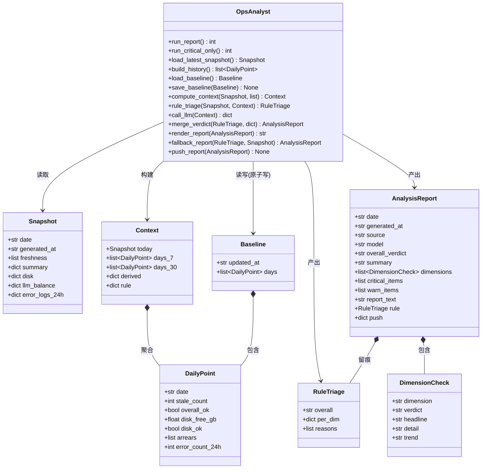
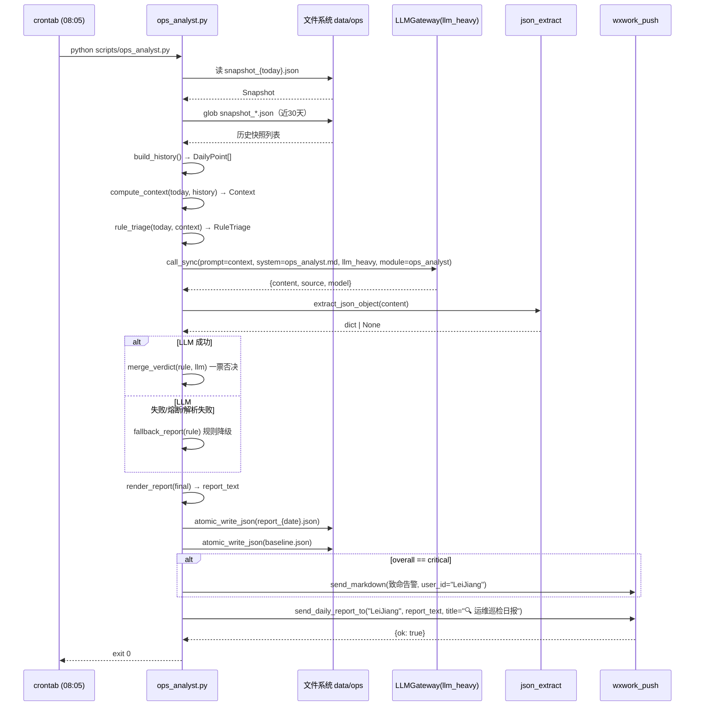

# 钱袋子 — 二期「AI 运维巡检日报」系统设计 + 任务分解

> 架构师：高见远　|　实施：寇豆码
> 代码基线：GitHub lj860117/moneybag，本地 `/Users/leijiang/WorkBuddy/moneybag-for-claudecode/`
> 上游：产品经理 PRD（AI 运维巡检日报）＋ 主理人已拍板决策（见下）
> 相关设计：`docs/ops/crontab.production.txt`（生产 crontab 唯一权威参考）

---

## 0. 需求与已拍板决策速览

**二期边界（重要，先划清）**：二期**只基于一期快照已有四类字段**做 LLM 分析，**不采集任何新指标**。
一期 `scripts/ops_summary.py`（08:03 cron）已落盘 `data/ops/snapshot_{date}.json`，字段固定为：

| 字段 | 含义 | 二期用法 |
|------|------|----------|
| `freshness` | 4 项巡检产物新鲜度（name/last_updated/stale_days/max_stale_days/ok） | LLM 判断「巡检链是否失效」 |
| `disk` | 磁盘 total/used/free_gb/ok | LLM 判断「磁盘是否告急 + 趋势」 |
| `llm_balance` | checked/balances{provider}/arrears[] | LLM 判断「余额/欠费风险」 |
| `error_logs_24h` | count_24h/files[]{file,keyword} | LLM 判断「24h 错误量」 |

> ⚠️ **PRD 偏差修正（主理人已确认）**：PRD P0-1 提到的「服务进程 / 内存 / DB 连接数 / 接口错误率」等指标，**一期快照并未采集**。本设计**明确剔除**这些指标，**不设计"采集新指标"模块**（那是独立任务）。相关指标降级为「未来扩展」，在 §9 待明确事项中登记。

**主理人已拍板决策（本方案严格遵循）**：

1. 日报只推 `LeiJiang`。
2. 告警三档：`critical`（立即推）/ `warn`（日报标黄 🟡）/ `info`（正常 ✅）。
3. 基线双窗口：**7 天异常检测 + 30 天趋势**。
4. 频率：日报每天 1 次（08:05，紧跟快照 08:03）；致命告警「实时」= 跑批内检测到 critical 立即推（见 §7 对"实时"的边界解释）。
5. 快照已含 cron exit code 字段位（一期留了位、当前未填），**二期不填、不分析**。

---

## 1. 实现方案（Implementation Approach）

### 1.1 核心难点与选型

| 难点 | 方案 | 理由 |
|------|------|------|
| LLM 对快照"编造指标"（幻觉） | **脚本先算派生事实（derived），LLM 只做判断**，prompt 明令"禁止编造快照里没有的指标" | 把数值计算留在确定性代码里，LLM 只做可解释性输出，消除幻觉空间 |
| 告警不能只靠 LLM（可靠性） | **确定性规则引擎 `rule_triage` 兜底 + LLM 一票否决合并**（`merge_verdict`） | 复用项目"降级为规则引擎"哲学（`TOKEN_BUDGET.on_exceed=degrade`）；critical 绝不能被 LLM 漏报/降级 |
| DeepSeek 偶尔在 JSON 前后加解释文字（铁律 M5） | 复用 `services/json_extract.py::extract_json_object`（三层防御：整体解析→剥 ```json``` 块→花括号计数） | 代码库已有多处同款用法（`multi_model_scorer.py` 等），不重造 |
| prompt 写死在代码里（铁律 M8） | 独立 `backend/prompts/ops_analyst.md`，运行时 `read_text` 读入，失败回退内置兜底 prompt | 与 `stock_monitor_cron.py:1111` 的 `close_review.md` 加载模式完全一致 |
| 基线冷启动（二期刚起步，可能只有 1 天历史） | `build_history` 直接 glob 快照文件自愈重建，历史 <7 天时派生事实标 `insufficient` | 不需要预热，天然幂等，baseline.json 损坏也能重建 |
| 落盘原子性（铁律 M4） | 全部经 `services/persistence.py::atomic_write_json` | 与 `ops_summary.py` 同款 |
| 架构分层 | 脚本放 `scripts/`，**只 `import`** infra/services/config，**不反向**；不新增 infra/services 文件 | 遵守 `.importlinter` 四层规则，`infra` 禁止依赖 `services` |

### 1.2 架构形态

纯**脚本（cron 单进程）**，非 API、非长驻服务，与一期 `ops_summary.py` 同构：

```
cron 08:05 ──> ops_analyst.py
                  │
                  ├─ 读快照 ────────────────── data/ops/snapshot_{date}.json（一期产物）
                  ├─ 建基线 ────────────────── data/ops/snapshot_*.json（最近30天）+ data/ops/baseline.json（滚动缓存）
                  ├─ 规则引擎 ──────────────── rule_triage()（确定性三档，零 LLM）
                  ├─ LLM 分析 ──────────────── infra.llm.gateway（llm_heavy）+ prompts/ops_analyst.md
                  ├─ 合并（一票否决）───────── merge_verdict(rule, llm)
                  ├─ 落盘 ──────────────────── data/ops/report_{date}.json（原子写）
                  └─ 推送 ──────────────────── services.wxwork_push（critical 立即推 + 日报推）
```

**分层约束**：`ops_analyst.py` 属于 `scripts/` 层，允许向上 `import` `infra.llm.gateway` / `services.persistence` / `services.json_extract` / `services.wxwork_push` / `config`；**绝不**新增任何 `infra/` 或 `services/` 文件，**绝不**让 infra/services 反向依赖 scripts。

---

## 2. 文件列表（File List）

| # | 相对路径 | 动作 | 职责 |
|---|----------|------|------|
| 1 | `backend/scripts/ops_analyst.py` | 新增 | 二期主脚本：基线引擎 + 规则告警 + LLM 分析 + 合并 + 渲染 + 推送 + 实时 critical 模式 |
| 2 | `backend/prompts/ops_analyst.md` | 新增 | LLM 分析 prompt 模板（铁律 M8，独立文件） |
| 3 | `backend/config.py` | 修改 | 新增 `OPS_*` 配置段（阈值 / 双窗口 / 推送目标，集中管理魔法数字） |
| 4 | `docs/ops/crontab.production.txt` | 修改 | 追加 08:05 日报 cron（+ 可选 `*/30` critical-only cron，注释默认关闭） |
| 5 | `backend/tests/test_ops_analyst.py` | 新增 | 单测：build_history / rule_triage / merge_verdict / render_report / fallback_report（纯函数，mock LLM 与推送） |

> 依赖包：**零新增第三方包**（详见 §6）。复用 `infra/llm/gateway.py`、`services/persistence.py`、`services/json_extract.py`、`services/wxwork_push.py`、`config.py`。

---

## 3. 数据结构与接口（Data Structures & Interfaces）

### 3.1 输入：一期快照 `Snapshot`（只读，`data/ops/snapshot_{date}.json`）

```json
{
  "date": "2026-09-06",
  "generated_at": "2026-09-06T21:26:59.607913",
  "freshness": [
    {"name": "数据源健康巡检", "last_updated": "...", "stale_days": 82, "max_stale_days": 1, "ok": false}
  ],
  "summary": {"checks": 4, "stale_count": 1, "overall_ok": false},
  "disk": {"total_gb": 39.3, "used_gb": 13.3, "free_gb": 24.2, "ok": true},
  "llm_balance": {"checked": true, "balances": {"deepseek": "¥31.15"}, "arrears": ["qwen"]},
  "error_logs_24h": {"count_24h": 1, "files": [{"file": "...", "keyword": "failed"}]}
}
```

> 二期**只依赖上表字段**，其余字段一律不读、不假设存在。

### 3.2 基线滚动单元 `DailyPoint` 与基线 `Baseline`（`data/ops/baseline.json`）

```json
// DailyPoint（每天一条，从快照抽取的精简点）
{"date": "2026-09-06", "stale_count": 1, "overall_ok": false,
 "disk_free_gb": 24.2, "disk_ok": true, "arrears": ["qwen"], "error_count_24h": 1}

// Baseline
{
  "updated_at": "2026-09-06T21:30:00",
  "days": [ /* DailyPoint 升序，去重，最多保留最近 30 个自然日 */ ]
}
```

`baseline.json` 是**派生缓存**：每次运行从 `snapshot_*.json` 重建（自愈），再原子写回。历史不足 30 天就只存已有天数。

### 3.3 喂给 LLM 的 `Context`（脚本拼装，`json.dumps` 后作为 prompt 内容）

```json
{
  "today": { /* 完整一期快照，原样透传 */ },
  "history": {
    "days_7":  [ /* DailyPoint 最近 7 天 */ ],
    "days_30": [ /* DailyPoint 最近 30 天 */ ]
  },
  "derived": {
    "history_days": 1,
    "disk_free_gb_now": 24.2,
    "disk_free_gb_7d_min": 24.2,
    "disk_free_gb_7d_max": 24.2,
    "disk_trend_30d": "insufficient",        // up | down | flat | insufficient
    "stale_count_now": 1,
    "stale_count_7d_avg": 1.0,
    "stale_names_now": ["数据源健康巡检"],
    "arrears_now": ["qwen"],
    "arrears_new_7d": true,
    "error_count_now": 1,
    "error_count_7d_total": 1
  },
  "rule": { /* RuleTriage 规则引擎兜底结果，供 LLM 一票否决参考 */ }
}
```

### 3.4 确定性规则引擎输出 `RuleTriage`

```json
{
  "overall": "critical|warn|info",
  "per_dim": {"freshness": "warn", "disk": "info", "llm_balance": "warn", "error_logs": "info"},
  "reasons": ["数据源健康巡检失效 82 天（阈值 1 天）", "qwen 欠费"]
}
```

**规则阈值（写进 `config.py`，脚本只读）**：

| 维度 | critical | warn | info |
|------|----------|------|------|
| `disk` | `free_gb <= 5.0`（与一期 `DISK_WARN_GB=5.0` 对齐） | `5.0 < free_gb <= 10.0` | `free_gb > 10.0` |
| `llm_balance` | `arrears` 含**主路由模型**（deepseek/doubao） | `arrears` 非空但仅含非路由模型（如 qwen）；或 `checked=false` | 无欠费且 checked |
| `error_logs` | `count_24h >= 10` | `3 <= count_24h < 10`（含 Traceback/Exception 时上浮一档） | `< 3` |
| `freshness` | （规则引擎**封顶 warn**，是否升级 critical 交给 LLM） | 任一项 `ok=false`（巡检链失效） | 全 ok |

`overall = max(per_dim)`，严重度序 `info < warn < critical`。

### 3.5 LLM 输出 Schema（`prompts/ops_analyst.md` 约束，`extract_json_object` 解析）

```json
{
  "overall_verdict": "critical|warn|info",
  "summary": "一句话总结（≤60字）",
  "dimensions": [
    {"dimension": "freshness|disk|llm_balance|error_logs",
     "verdict": "critical|warn|info",
     "headline": "≤20字",
     "detail": "数据支撑（≤80字）",
     "trend": "7日/30日趋势（≤40字，数据不足写『数据不足，待积累』）"}
  ],
  "critical_items": [{"title": "≤30字", "action": "建议动作（≤50字）"}],
  "warn_items":     [{"title": "≤30字", "action": "建议动作（≤50字）"}],
  "report_text": "给 LeiJiang 的日报正文（纯文本，≤1500字，🔴/🟡/✅ 标记严重度，不用 ** / # 等 markdown 符号）"
}
```

### 3.6 最终产物 `AnalysisReport`（落盘 `data/ops/report_{date}.json`，原子写）

```json
{
  "date": "2026-09-06",
  "generated_at": "2026-09-06T08:05:01",
  "source": "llm",                         // llm | rule_fallback（LLM 失败/熔断时）
  "model": "deepseek-v4-pro",              // rule_fallback 时为空
  "overall_verdict": "warn",
  "summary": "...",
  "dimensions": [ /* 同 LLM 输出 dimensions */ ],
  "critical_items": [],
  "warn_items": [{"title": "...", "action": "..."}],
  "report_text": "...",
  "rule": { /* RuleTriage 留痕，便于审计 */ },
  "push": {"target": "LeiJiang", "critical_pushed": false, "daily_pushed": true}
}
```

### 3.7 类图（Mermaid）



---

## 4. 程序调用流程（Program Call Flow）

### 4.1 主流程（日报，`python scripts/ops_analyst.py`）

1. `load_latest_snapshot()`：读 `DATA_DIR/ops/snapshot_{today}.json`；缺失则回退 glob 最新一份 `snapshot_*.json`；都无 → 退出码 2（打日志，不推）。
2. `build_history()`：glob `DATA_DIR/ops/snapshot_*.json`，按 `date` 升序取最近 30 个自然日，每份抽成 `DailyPoint`。
3. `compute_context(today, history)`：算 `derived`（7 日极值 / 30 日趋势 / 新欠费 / 均值），组装 `Context`。
4. `rule_triage(today, context)`：确定性三档（零 LLM）。
5. `call_llm(context)`：`LLMGateway.instance().call_sync(..., model_tier="llm_heavy", module="ops_analyst")` → `extract_json_object(content)`。
   - LLM 失败 / 熔断 / 解析失败 → 走 `fallback_report(rule)`（纯规则文本）。
6. `merge_verdict(rule, llm)`：**一票否决** —— `final.overall = max(rule.overall, llm.overall)`，LLM 只能升级不能降级 critical。
7. `render_report(final)`：取 `report_text`（或 fallback 拼装），组装标题 `🔍 钱袋子运维巡检日报 {date}`。
8. 落盘：`atomic_write_json(report_{date}.json)` 与 `atomic_write_json(baseline.json)`（铁律 M4）。
9. 推送：`overall == critical` → 先 `send_markdown` 推「🚨 致命告警」短消息（critical_items + 建议动作）；随后 `send_daily_report_to("LeiJiang", report_text, title=...)`。非 critical → 只推日报。
10. `exit 0`。

### 4.2 实时致命告警模式（`python scripts/ops_analyst.py --critical-only`，可选 cron）

仅执行**第 1–4 步 + critical 判断**：读最新快照 → 规则引擎 → 若 `overall == critical` 且与 `data/ops/critical_state.json` 里的签名不同 → 立即 `send_markdown` 推送并更新签名。**不调 LLM、不产日报、不推非 critical**。用于"critical 实时"（无需新指标，重扫最新快照即可）。

### 4.3 时序图（Mermaid）



---

## 5. Anything UNCLEAR（待明确事项）

1. **`safe_parse_json` 实际函数名**：代码库中**不存在** `safe_parse_json`，等价实现是 `services/json_extract.py::extract_json_object(text) -> dict|None`。本设计按此函数落地（铁律 M5 的实际载体）。若主理人坚持 `safe_parse_json` 命名，可加一层 3 行薄封装，但建议直接用现成的 `extract_json_object`。
2. **LeiJiang 的企微 userId**：业务侧账号叫 `LeiJiang`，但企微 `touser` 实际值可能是手机号/别名。设计默认 `OPS_REPORT_USER_ID` 环境变量，缺省 `"LeiJiang"`；上线前需确认企微后台 `touser` 实际值（`services/wxwork_push.py` 的 `send_daily_report_to` 直接透传给 `touser`）。
3. **"致命告警实时"的边界**：二期不采集新指标，快照每天 08:03 才更新一次，故"实时"的上限是「每次快照更新后立即检测」——即 08:05 跑批内 critical 立即推。`--critical-only` 模式已设计好，可挂 `*/30` cron 高频重扫最新快照，但**默认不注册**（快照本身不更新，高频重扫收益有限）。是否挂高频 cron 需主理人拍板。
4. **qwen 欠费的档位**：qwen 不在当前双模型路由（deepseek/doubao）内，`arrears:["qwen"]` 默认归 **warn**（历史遗留欠费，提醒但不阻断）。若 deepseek/doubao 也欠费 → **critical**。
5. **cron exit code 字段位**：一期快照留了位但未填，二期**不填、不分析**（已确认）。
6. **数据目录漂移**：一期 `ops_summary.py` 已做权威 `DATA_DIR/ops` + 历史 `backend/data` 双目录扫描。二期的**落盘统一走 `DATA_DIR/ops`（权威目录）**，不再写 `backend/data/ops`，避免加剧漂移；读取历史快照时也同时扫两处（与一期 `_candidate_dirs` 一致）。
7. **冷启动**：二期刚上线历史可能只有 1 天，`derived` 中所有趋势标 `insufficient`，prompt 明令 LLM 写"数据不足，待积累"，禁止硬编 30 日趋势。

---

## 6. Required Packages（依赖包）

**零新增第三方包。** 仅用 Python 标准库 + 已有项目模块：

| 依赖 | 来源 | 用途 |
|------|------|------|
| `json / os / shutil / sys / datetime / pathlib / typing` | 标准库 | 基础 |
| `infra.llm.gateway.LLMGateway` | 已有 | 统一 LLM 入口（路由+降级+计费+熔断），`llm_heavy` |
| `services.persistence.atomic_write_json` | 已有 | 原子落盘（铁律 M4） |
| `services.json_extract.extract_json_object` | 已有 | LLM JSON 安全解析（铁律 M5） |
| `services.wxwork_push`（`is_configured`/`send_daily_report_to`/`send_markdown`） | 已有 | 企微推送 |
| `config`（`DATA_DIR` + 新增 `OPS_*`） | 已有 | 数据目录 + 阈值/窗口/推送目标 |

> `httpx` 由 gateway 内部 import，脚本不直接依赖。

---

## 7. Task List（任务分解，按实现顺序）

> 说明：本功能是**单脚本特性**（1 主脚本 + 1 prompt + 1 config 段 + 1 cron + 1 测试），`ops_analyst.py` 为唯一主模块，任务按**功能增量**递进，每步可独立验证。任务数 4（≤5），依赖为一条必然的单脚本增量链。

| Task ID | 任务名 | Source Files | 依赖 | 优先级 |
|---------|--------|--------------|------|--------|
| **T01** | 基础设施与数据契约 | ①`backend/config.py`（新增 `OPS_*` 段）②`backend/prompts/ops_analyst.md`（完整 prompt）③`backend/scripts/ops_analyst.py`（骨架：常量/路径/`load_latest_snapshot`/`load_baseline`/`save_baseline`/`atomic_write` 落盘 helper/`main` 空壳）④`backend/tests/test_ops_analyst.py`（fixture：构造假快照 + 数据加载用例） | — | P0 |
| **T02** | 基线引擎 + 确定性规则告警 | ①`backend/scripts/ops_analyst.py`（`build_history`/`compute_context`/`rule_triage`/`fallback_report`）②`backend/tests/test_ops_analyst.py`（基线重建 + 规则阈值用例）③（读）`backend/config.py` 阈值 | T01 | P0 |
| **T03** | LLM 分析 + 一票否决合并 + 日报渲染 | ①`backend/scripts/ops_analyst.py`（`call_llm`（gateway+`extract_json_object`）/`merge_verdict`/`render_report`/主流水线串联至落盘）②`backend/prompts/ops_analyst.md`（必要时微调 schema 措辞）③`backend/tests/test_ops_analyst.py`（mock LLM + 合并/渲染用例） | T02 | P0 |
| **T04** | 推送 + cron 调度 + 实时 critical + 上线验证 | ①`backend/scripts/ops_analyst.py`（`push_report`/`run_critical_only`/`main` 完整化）②`docs/ops/crontab.production.txt`（追加 08:05，注释默认关闭 `*/30` critical）③服务器 crontab 部署 + `/var/log/moneybag/ops_analyst.log` 日志验证 + 回滚预案 | T03 | P0 |

---

## 8. Shared Knowledge（跨文件约定）

- **prompt 放哪**：`backend/prompts/ops_analyst.md`，运行时 `(Path(__file__).parent.parent / "prompts" / "ops_analyst.md").read_text(encoding="utf-8")` 读入，读不到则回退内置兜底 prompt（铁律 M8，模式同 `stock_monitor_cron.py:1111`）。
- **基线数据存哪**：`DATA_DIR/ops/baseline.json`（`DATA_DIR` 来自 `config.DATA_DIR`，权威 `/opt/moneybag/data`）。派生缓存，每次从 `snapshot_*.json` 重建，最多 30 天滚动。**只写权威目录，不写 `backend/data/ops`**。
- **报告存哪**：`DATA_DIR/ops/report_{date}.json`（`{date}` 用 `date.today().isoformat()`）。
- **critical 去重状态**：`DATA_DIR/ops/critical_state.json`（`--critical-only` 模式去重用）。
- **落盘铁律 M4**：所有 JSON 写盘必须 `services.persistence.atomic_write_json(filepath: Path, data: dict)`，禁止裸 `write_text`。
- **解析铁律 M5**：LLM 输出必须 `services.json_extract.extract_json_object(content)`，失败返回 None → 走 `fallback_report`。
- **LLM 调用签名**（照抄）：
  ```python
  from infra.llm.gateway import LLMGateway
  r = LLMGateway.instance().call_sync(
      prompt=context_json_str, system=prompt_text,
      model_tier="llm_heavy", user_id="ops", module="ops_analyst",
      max_tokens=3000,
  )
  content = (r.get("content") or "").strip()
  parsed = extract_json_object(content)  # None → fallback
  ```
  `source` 非 `"ai"`（`rate_limited`/`api_error`/`error`）或 `content` 为空 → 一律 fallback。
- **一票否决**：`final.overall = max(rule.overall, llm.overall)`，`info < warn < critical`。rule 的 critical 绝不能被 LLM 降级。
- **推送**：`send_daily_report_to("LeiJiang", report_text, title="🔍 钱袋子运维巡检日报")`；critical 先用 `send_markdown("🚨 ...", user_id="LeiJiang")` 立即推。`send_markdown` 会自动去 markdown 符号 + 超 1800 字分段，故 `report_text` 直接用纯文本 + emoji，不写 `**`/`#`。
- **推送目标可配**：`config.OPS_REPORT_USER_ID = os.getenv("OPS_REPORT_USER_ID", "LeiJiang")`。
- **日志**：cron 重定向到 `/var/log/moneybag/ops_analyst.log`（与 `ops_summary.log` 同级）。
- **版本号**：上线时按项目惯例 bump `config.APP_VERSION`（当前 `9.9.14`）。

---

## 9. 任务依赖图（Task Dependency Graph）


---

## 附录 A：`backend/config.py` 新增 `OPS_*` 配置段（T01 落地）

```python
# ---- 二期 AI 运维巡检日报（ops_analyst.py）----
OPS_DIR_NAME = "ops"                     # DATA_DIR 下子目录名
OPS_REPORT_USER_ID = os.environ.get("OPS_REPORT_USER_ID", "LeiJiang")  # 日报只推 LeiJiang
OPS_BASELINE_FILE = "baseline.json"      # 滚动基线
OPS_CRITICAL_STATE_FILE = "critical_state.json"  # 实时 critical 去重
OPS_WINDOW_7D = 7                        # 7 天异常检测窗口
OPS_WINDOW_30D = 30                      # 30 天趋势窗口（也是基线最多保留天数）
OPS_DISK_CRITICAL_GB = 5.0               # 磁盘 critical 阈值（与 ops_summary.DISK_WARN_GB 对齐）
OPS_DISK_WARN_GB = 10.0                  # 磁盘 warn 阈值
OPS_ERROR_CRITICAL_COUNT = 10            # 24h 错误日志 critical 条数
OPS_ERROR_WARN_COUNT = 3                 # 24h 错误日志 warn 条数
OPS_ROUTED_PROVIDERS = ("deepseek", "doubao")  # 主路由模型（欠费=critical）
OPS_LLM_MODEL_TIER = "llm_heavy"         # 分析用重档（DeepSeek V4 Pro，豆包 Seed 2.1 Pro 兜底）
OPS_LLM_MAX_TOKENS = 3000
```

## 附录 B：`backend/prompts/ops_analyst.md` 模板全文（T01 落地）

````markdown
# 角色
你是钱袋子（MoneyBag）的运维巡检分析官。钱袋子是 FastAPI + JSON 文件存储 + 双 LLM（DeepSeek V4 / 豆包 Seed 2.1）的家庭资产管理系统，单机 Ubuntu 部署，靠 cron 跑巡检。你每天收到一份「运行态势快照」+ 历史基线，判断系统是否健康、要不要告警。

# 输入
一个 JSON（context），结构：
- today：今日快照，四类字段 freshness（巡检新鲜度）/ disk（磁盘）/ llm_balance（余额·欠费）/ error_logs_24h（24h 错误日志）
- history：days_7 / days_30 每日精简点
- derived：脚本已算好的派生事实（趋势 / 7 日极值 / 新欠费等）
- rule：规则引擎兜底结果

# 告警三档定义
- critical（致命）：必须立即人工介入，否则可能宕机/不可用。例：磁盘 < 5GB、主模型（deepseek/doubao）欠费、24h 错误 ≥10 条且含 Traceback。
- warn（警告）：值得关注但不立即宕机。例：巡检链失效、非路由模型（qwen）欠费、磁盘偏低、错误日志异常增多。
- info（正常）：指标健康。

# 输出格式（必须严格 JSON，不要输出任何其他内容）
```json
{
  "overall_verdict": "critical|warn|info",
  "summary": "一句话总结（≤60字）",
  "dimensions": [
    {"dimension": "freshness|disk|llm_balance|error_logs",
     "verdict": "critical|warn|info",
     "headline": "≤20字",
     "detail": "数据支撑（≤80字）",
     "trend": "7日/30日趋势（≤40字，数据不足写『数据不足，待积累』）"}
  ],
  "critical_items": [{"title": "≤30字", "action": "建议动作（≤50字）"}],
  "warn_items": [{"title": "≤30字", "action": "建议动作（≤50字）"}],
  "report_text": "给老板 LeiJiang 的日报正文（纯文本，≤1500字，用 🔴/🟡/✅ 标记严重度，不用 ** 或 # 等 markdown 符号）"
}
```

# 判断原则
1. **数据说话**：结论必须能追溯到 today/derived 里的具体数字；**禁止编造快照里没有的指标**（进程数、内存、DB 连接数、接口错误率等一律不存在，不得臆造）。
2. **趋势诚实**：history_days < 7 时，趋势一律写「数据不足，待积累」，禁止硬编 30 日趋势。
3. **一票否决**：你的 overall_verdict 只能 >= rule.overall（info < warn < critical），不得把 critical 降级。
4. **overall_verdict 取四维度最严重者**。
5. **只输出 JSON，不要输出任何解释文字**。
````
