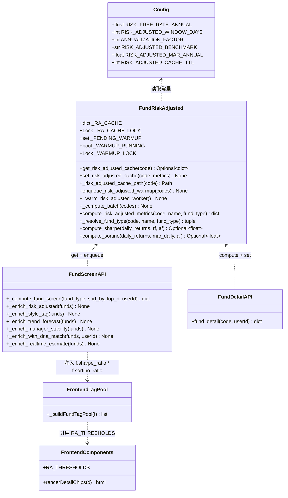
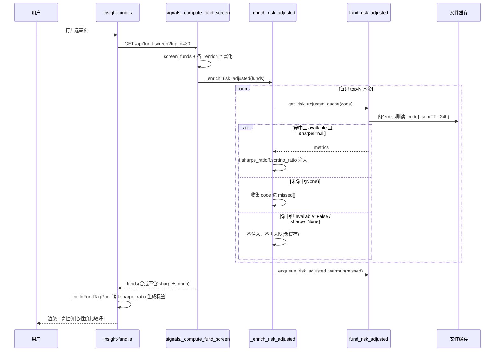
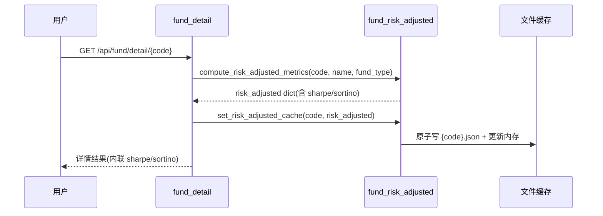
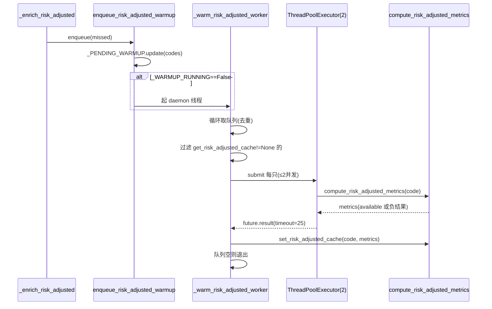
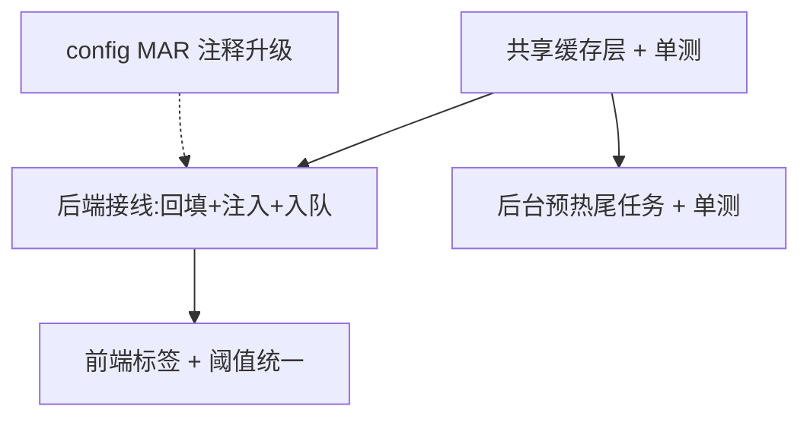

# 钱袋子 — 选基「性价比标签」+ Sortino MAR 口径固化（增量实现方案）

> 架构师：高见远　|　实施：寇豆码　|　合并发布两项 PRD 增量
> 代码基线：GitHub lj860117/moneybag，本地 `/Users/leijiang/WorkBuddy/moneybag-for-claudecode/`

---

## 0. 需求与已拍板决策速览

两项合并发布：

1. **选基列表性价比标签**：把已落地的 `compute_risk_adjusted_metrics` 的 Sharpe 指标，以「高性价比 / 性价比较好」标签形式回灌到选基列表（`pages/insight-fund.js` 的 `_buildFundTagPool`），恢复上一轮删除的 1024–1026 行死代码为真逻辑。
2. **Sortino MAR 口径固化**：`RISK_ADJUSTED_MAR_ANNUAL` 保持 `0.0`，仅升级 `config.py` 注释固化决策，不改计算代码、不暴露前端。

产品经理已拍板（本方案严格遵循）：

- **决策 1**：标签注入走「共享缓存读取 + 异步批量预热 + 详情回填」，绝不逐只同步计算。
- **决策 2**：MAR 保持 0，仅后端 config 注释升级，不改代码、不暴露前端。

---

# Part A：系统设计

## 1. 实现方案（Implementation Approach）

### 1.1 核心难点与选型

| 难点 | 分析 | 选型 |
|---|---|---|
| 选基列表 top-N 逐只同步算 Sharpe 会拖垮首屏（每只要拉 3 年净值 + 沪深300，秒级/只） | 必须**只读缓存**，未命中**绝不阻塞、绝不发起网络** | 共享文件缓存 + 内存缓存，命中注入 / 未命中入队 |
| 缓存要有单一来源，避免详情、列表、AI 评分三处口径漂移 | 详情计算完是唯一「新鲜真值」产生点 | 共享缓存落在 `fund_risk_adjusted.py`，详情/预热都写它，列表只读它 |
| FastAPI 多线程（`def` 路由跑线程池）+ 后台预热线程并发读写 | 竞态：读到半截文件、重复计算 | 单把 `threading.Lock` 保护内存+文件；文件原子写（`os.replace`） |
| 预热不能打满 Tushare 限流、不能挂死主请求 | 后台尾任务，串行 + 限并发 + 单只超时 | `daemon` 线程 + `ThreadPoolExecutor(max_workers=2)` + `future.result(timeout=25)` |
| 列表标签与详情弹窗分档两处漂移 | 阈值要单一来源 | 前端 `window.RA_THRESHOLDS` 常量（放 `_components.js`），两处引用 |

**架构模式**：延续现有「分层 + 单一来源缓存」模式（与 `fund_detail` 24h 文件缓存、`fund_screen` 10h/72h 文件缓存同构），不引入新框架、不新建一堆文件。共享缓存直接放在 `fund_risk_adjusted.py` 里（它是计算与数据源的唯一入口，天然是单一来源）。

### 1.2 共享缓存数据结构与语义（单一来源）

- **内存**：`_RA_CACHE: dict = {code: {"v": metrics_dict, "t": epoch}}`
- **文件**：`DATA_DIR/_cache/fund_risk_adjusted/{code}.json`，内容 `{"v": <compute_risk_adjusted_metrics 完整返回 dict>, "t": epoch}`（与 `fund_detail._set_cached` 的 `{"v","t"}` 信封一致）。
- **TTL**：24h（新增 `config.RISK_ADJUSTED_CACHE_TTL = 86400`），与 `fund_detail` 24h、`fund_screen` 10h 语义一致——指标是日频数据，24h 内不会变。
- **正缓存 + 负缓存都落盘**：`compute_risk_adjusted_metrics` 返回 `available=False`（债/QDII/货币等不可计算）也写缓存。这样列表注入与预热队列能区分「没算过（要补算）」vs「算过了但不可用（别再补算）」，避免债券榜每屏都重复入队。

> **关键判别**：`get_risk_adjusted_cache(code)` 返回 `None` = 「没算过」→ 入队补算；返回 dict 但 `available=False` 或 `sharpe_ratio=None` = 「算过但无指标」→ 不注入、**不再入队**。

### 1.3 读写接口签名（放在 `fund_risk_adjusted.py`）

```python
def get_risk_adjusted_cache(code: str) -> Optional[dict]:
    """读共享性价比缓存（内存优先，文件兜底，TTL 内有效）。未命中返回 None。"""

def set_risk_adjusted_cache(code: str, metrics: dict) -> None:
    """写共享性价比缓存（内存 + 文件原子写）。metrics 为 compute_risk_adjusted_metrics 返回 dict。"""

def enqueue_risk_adjusted_warmup(codes: Sequence[str]) -> None:
    """把未命中 code 加入待预热队列；若当前无预热在跑则起后台 daemon 线程批量补算。"""

def _risk_adjusted_cache_path(code: str) -> Path: ...
def _warm_risk_adjusted_worker() -> None: ...
def _compute_batch(codes: List[str]) -> None: ...
```

### 1.4 线程安全策略（明确结论）

- **单把 `threading.Lock` `_RA_CACHE_LOCK`**：保护 `_RA_CACHE` 内存 dict + 文件读/写。读写都是小对象、写不频繁，不需要读写锁。
- **读路径**：锁内做「内存查 → 文件查 → 回填内存」，锁外返回。**绝不把 `compute_risk_adjusted_metrics`（有网络）放进锁内**。
- **写路径**：锁内写内存 + 写文件（先写 `{code}.json.tmp` 再 `os.replace` 原子替换，避免并发读到半截文件）。
- **幂等写**：last-write-wins，同一 code 的两次写内容等价（同口径同数据），无需版本号/compare-and-swap。
- **预热队列守卫**：`_WARMUP_LOCK` + `_WARMUP_RUNNING` 布尔，保证同一时刻只有一个预热 worker 在跑；worker 循环取队列直到空才置 `_WARMUP_RUNNING=False`，避免多个尾任务并发打 Tushare。

### 1.5 与现有缓存体系的关系与去重

| 缓存 | 路径/键 | TTL | 内容 | 与本方案关系 |
|---|---|---|---|---|
| 详情缓存 | `_cache/fund_detail/fund_detail_{code}[_{userId}].json` | 24h fresh / 72h stale | 整个详情结果（含 sharpe/sortino 内联） | **不同源**：按详情整体缓存，键含 userId，列表读不动。共享性价比缓存从它**抽取单一真值** |
| 选基缓存 | `_cache/fund_screen_{ft}_{sort}_{user}.json` | 10h fresh / 72h stale | 整个选基结果（本次注入后含 sharpe/sortino） | **上游消费方**：注入发生在 `_compute_fund_screen` 计算时，注入结果随选基缓存持久化 |
| **共享性价比缓存（新增）** | `_cache/fund_risk_adjusted/{code}.json` | 24h | 仅性价比指标契约 dict | **单一来源**：列表注入只读它；详情回填 + 预热写它 |

**去重结论**：性价比数值只存一份（共享缓存）。详情缓存里的 `sharpe_ratio` 等字段继续内联返回（不破坏前端详情弹窗），但详情计算完成后**同步写共享缓存**；列表注入**绝不**再算，只读共享缓存。AI 评分端点（`fund_ai_score`）当前逻辑保持不变（它只在详情缓存缺指标时实时补算，可后续顺手写共享缓存，属可选优化，本期不动）。

---

## 2. 文件清单（File List）

新增文件：

```
backend/tests/test_fund_risk_adjusted_cache.py   # 共享缓存读写/TTL/负缓存/预热队列单测
```

修改文件：

```
backend/config.py                                 # +RISK_ADJUSTED_CACHE_TTL（T01）；MAR 注释升级（T05）
backend/services/fund_risk_adjusted.py            # +共享缓存读写 + 预热队列 + 后台 worker（T01/T02/T03）
backend/api/fund_detail.py                        # 详情算完 5 指标后写共享缓存（回填，T02）
backend/api/signals.py                            # +_enrich_risk_adjusted 读缓存注入 + 调用点（T02）
pages/_components.js                              # +window.RA_THRESHOLDS 阈值常量 + Sharpe chip 对齐（T04）
pages/insight-fund.js                             # _buildFundTagPool 恢复「高性价比/性价比较好」标签（T04）
```

> 不新建服务模块——共享缓存、队列、worker 全部收敛在 `fund_risk_adjusted.py`（计算与数据源唯一入口）。

---

## 3. 数据结构与接口（classDiagram）



---

## 4. 程序调用流（sequenceDiagram）

### 4.1 选基列表首屏（读缓存 → 注入 → 未命中入队）



### 4.2 详情回填（同步写共享缓存）



### 4.3 后台批量预热（串行 + 限并发 + 单只超时）



---

## 5. 待明确事项 / 假设（Anything UNCLEAR）

1. **`value_label=null` 与 `f.sharpe_ratio` 的措辞统一**：决策里「标记 value_label=null」与「只注入数值字段 f.sharpe_ratio」表述不一致。**本方案取后者**：命中注入 `f.sharpe_ratio`（可选 `f.sortino_ratio`），未命中/不可用则**不写这两个字段**（等价于前端 `f.sharpe_ratio==null` 不显示）。不额外引入 `value_label` 字段，减少契约面。
2. **注入字段范围**：列表只注入 `sharpe_ratio`（标签驱动）与 `sortino_ratio`（顺手，详情弹窗已展示 Sortino，前端可复用）。Calmar/IR/Treynor/β 不注入列表（详情弹窗才用）。
3. **预热 worker 的超时语义**：`future.result(timeout=25)` 超时只代表「不等了」，底层线程仍在跑（Python 线程不可强杀）。这是现有 `_bg_refresh_fund_screen` / cache_warmer 同款取舍，可接受；worker 线程是 daemon，进程退出即回收。
4. **cache_warmer 是否加专用预热模式**：本期**不加**。现有 `cache_warmer` 早盘预热已通过 `/api/fund/detail/{top10}` 间接回填共享缓存；新增的内联尾任务负责「用户首屏未命中」的即时回填。若后续想增加定时全量预热，再在 `cache_warmer` 加 `--warm-risk-adjusted`（可选，非本期范围）。
5. **并发上限取值**：`_WARM_MAX_WORKERS=2`、`_WARM_PER_CODE_TIMEOUT=25.0` 为初始值，写死在 `fund_risk_adjusted.py` 模块常量（非 config），后续可调。
6. **Sharpe 阈值现有漂移的修复**：`_components.js` 详情 Sharpe chip 的颜色分档用 `>=0.8` 当中档，而其弹窗文案写「1.0~1.5 良好」。本期 T04 顺手对齐到共享常量 `1.0`，消除既有文案/颜色漂移（属小修复，会一并覆盖）。

---

# Part B：任务分解

## 6. Required Packages

无需新增第三方包，全部使用 Python 标准库 + 现有代码：

```
- (无新增) 后端仅用标准库：json / os / time / threading / pathlib / concurrent.futures
- (无新增) 前端原生 JS，复用现有 insight-fund.js / _components.js
```

## 7. 任务列表（按依赖顺序，≤5 个）

> 说明：本项为**增量改动**（非绿地全栈），任务粒度比绿地模板小。仍按「功能模块/层次」分组，未按单文件拆分；其中 T05 为注释级单文件改动，已标注为 P2 低风险。

| Task | 名称 | 源文件 | 依赖 | 优先级 |
|---|---|---|---|---|
| **T01** | 共享性价比缓存层（内存+文件+TTL+锁）+ 单测 | `backend/config.py`、`backend/services/fund_risk_adjusted.py`、`backend/tests/test_fund_risk_adjusted_cache.py`(新) | — | P0 |
| **T02** | 后端接线：详情回填 + 选基读缓存注入 + 未命中入队 | `backend/api/fund_detail.py`、`backend/api/signals.py`、`backend/services/fund_risk_adjusted.py` | T01 | P0 |
| **T03** | 后台批量预热尾任务（worker + 线程守卫 + 超时）+ 单测 | `backend/services/fund_risk_adjusted.py`、`backend/tests/test_fund_risk_adjusted_cache.py` | T01 | P0 |
| **T04** | 前端恢复「高性价比/性价比较好」标签 + 阈值常量统一 | `pages/_components.js`、`pages/insight-fund.js` | T02 | P0 |
| **T05** | config 注释升级固化 MAR=0 决策（不改代码） | `backend/config.py` | — | P2 |

### 各任务实施要点

**T01 — 共享性价比缓存层 + 单测**
- `config.py`：在「基金性价比」段新增 `RISK_ADJUSTED_CACHE_TTL = 86400`（秒），不动 `RISK_ADJUSTED_MAR_ANNUAL`。
- `fund_risk_adjusted.py`：新增 `import os/json/time/threading`、`from pathlib import Path`、`from config import ..., DATA_DIR`；实现 `_RA_CACHE_DIR`、`_RA_CACHE`、`_RA_CACHE_LOCK`、`_risk_adjusted_cache_path`、`get_risk_adjusted_cache`、`set_risk_adjusted_cache`（原子写）。
- `test_fund_risk_adjusted_cache.py`（新）：`set→get` 往返、文件回退（清内存后仍命中）、TTL 过期返回 None、原子写不产生半截文件、负缓存（`available=False`）也往返。

**T02 — 详情回填 + 选基注入 + 入队**
- `fund_detail.py`：在 602 行 `risk_adjusted = compute_risk_adjusted_metrics(...)` 后（`risk_adjusted` 非空时）调用 `set_risk_adjusted_cache(code, risk_adjusted)`。
- `fund_risk_adjusted.py`：新增 `_PENDING_WARMUP`、`_WARMUP_LOCK`、`enqueue_risk_adjusted_warmup`（先只做「入队 + 起线程占位」，worker 体在 T03 补，或直接放 T01 也可——见 T03）。
- `signals.py`：新增 `_enrich_risk_adjusted(funds)`，实现「`get_risk_adjusted_cache` 命中且 `available` 且 `sharpe_ratio is not None` → 注入 `f["sharpe_ratio"]`/`f["sortino_ratio"]`；`None` → 收集入 missed；负缓存 → 跳过」；在 `_compute_fund_screen` 的富化阶段（建议 `_enrich_realtime_estimate` 之后、`my_holdings_summary` 之前）调用，并对 missed 调 `enqueue_risk_adjusted_warmup`。

**T03 — 后台批量预热尾任务 + 单测**
- `fund_risk_adjusted.py`：实现 `_warm_risk_adjusted_worker`（循环取队列、`_WARMUP_RUNNING` 守卫）与 `_compute_batch`（`ThreadPoolExecutor(max_workers=2)` + `future.result(timeout=25)`，算完 `set_risk_adjusted_cache` 落正/负缓存）。
- `test_fund_risk_adjusted_cache.py`：补预热队列去重、跳过已缓存（TTL 内）、并发守卫（`_WARMUP_RUNNING`）、超时不抛、不可计算基金落负缓存。

**T04 — 前端恢复标签 + 阈值统一**
- `_components.js`：顶部定义 `window.RA_THRESHOLDS = { sharpe_excellent: 1.5, sharpe_good: 1.0 }`（如需要可加 `sortino_excellent:2.0, sortino_good:1.0`）；把详情 Sharpe chip 的颜色分档 `>=0.8` 对齐为 `>=RA_THRESHOLDS.sharpe_good`（顺带修复文案/颜色漂移）。
- `insight-fund.js`：在 `_buildFundTagPool` 原 1024–1026 行死代码处恢复真逻辑：
  ```js
  // 6.5 性价比标签（后端注入 f.sharpe_ratio，近3年/Rf=2%口径）
  const _t = (window.RA_THRESHOLDS||{sharpe_excellent:1.5,sharpe_good:1.0});
  if(f.sharpe_ratio != null){
    if(f.sharpe_ratio >= _t.sharpe_excellent){
      tags.push({kind:'style', label:'⭐ 高性价比', color:'#86EFAC', bg:'rgba(34,197,94,.15)', title:`近3年夏普${f.sharpe_ratio}，风险调整后收益优秀`});
    } else if(f.sharpe_ratio >= _t.sharpe_good){
      tags.push({kind:'style', label:'👍 性价比较好', color:'#00E5A0', bg:'rgba(16,185,129,.15)', title:`近3年夏普${f.sharpe_ratio}`});
    }
  }
  ```
  （阈值/文案/颜色全由前端决定，后端只给数值。）

**T05 — config 注释升级（不改代码）**
- `config.py` 95–96 行注释改为：固定 0 与 `empyrical.sortino_ratio(returns, required_return=0)` 对齐；如改 `0.02` 须同步改 `pages/_components.js` 568–572 行 Sortino 文案（MAR=0 → MAR=2%）及阈值说明，否则口径漂移。

## 8. Shared Knowledge（跨切面约定）

- 缓存信封统一 `{"v": <value>, "t": <epoch_seconds>}`（与 `fund_detail._set_cached` 一致）。
- 共享性价比缓存键 = 基金代码 `code`（不含 userId、不含 fund_type），单一来源。
- 缓存目录统一在 `DATA_DIR/_cache/` 下：`fund_risk_adjusted/`、`fund_detail/`、`fund_screen_*.json` 并列。
- 所有缓存读写必须 `try/except` 包裹，**失败静默降级**（fail-open），绝不影响主请求返回。
- 注入字段只给数值 `sharpe_ratio`/`sortino_ratio`；文案、阈值、颜色一律前端决定。
- 计算函数 `compute_risk_adjusted_metrics` **永不抛异常**（内部已 fail-open），负缓存 = `available=False` 的结果。
- 单测必须走 `conftest.py` 的 DATA_DIR 隔离（自动生效），涉及 `tushare_data` 用 `monkeypatch` 打桩，不得发起真实网络。

## 9. 任务依赖图



> T05 为纯注释改动，逻辑上可独立于任意任务；标虚线表示「可并行、无强依赖」，但建议与 T02 一起过一遍（确保注释引用的行号与代码一致）。
